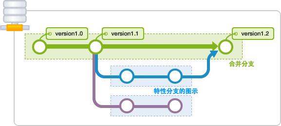
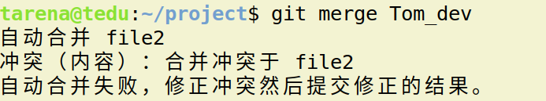

综合项目及工具
==========================

| Tedu Python 教学部 |
| --- |
| Author：吕泽|

-----------

[TOC]

## 1. 软件项目开发

### 1.1 软件项目开发流程

```
需求分析 ----> 概要设计  ---> 项目计划 ----> 详细设计---> 编码测试 -----> 项目测试 ----> 调试修改 ---> 项目发布----> 后期维护
```

* 需求分析 ： 确定用户的真实需求 

>  1. 确定用户的真实需求，项目的基本功能
>  2. 确定项目的整体难度和可行性分析
>  3. 需求分析文档，用户确认

* 概要设计：对项目进行初步分析和整体设计

> 1. 确定整体架构
> 2. 进行技术可行性分析
> 3. 确定技术整体思路和使用框架模型
> 4. 形成概要文档指导开发流程


* 项目计划 ： 确定项目开发的时间轴和流程

> 1. 确定开发工作的先后顺序
> 2. 确定时间轴  ，事件里程碑
> 3. 确定人员分工 
> 4. 形成甘特图和思维导图等辅助内容


* 详细设计 ： 项目的具体实现

> 1. 构建具体模块的编程逻辑
>
> 2. 形成详细设计文档 ： 思路分析，逻辑流程，功能说明，技术点说明，数据库设计，数据结构说明，重点代码说明，等等

* 编码测试 ： 按照预定计划实现代码编写，并且做基本检测

> 1. 根据详细设计完成代码编写
> 2. 写测试程序样例
> 3. 进行技术难点攻关

* 项目测试 ： 对项目按照功能进行测试

> 1. 根据测试方案完成项目测试
> 2. 完成测试报告
> 3. 根据测试报告进行代码修改

* 项目发布

> 1.项目交付用户进行发布
>
> 2.编写项目说明文档

* 后期维护

> 1.维护项目正常运转
>
> 2.进行项目的迭代升级

### 1.2  开发注意事项

* 按时完成项目是开发过程中的红线
* 项目实施人员之间的冲突

### 1.3 项目管理工具

* 编写文档： word  ppt  excel  markdown 
* 项目流程图 ： xmind   visio
* 项目管理 ： project
* 代码管理 ： svn   git


## 2. GIT使用

### 2.1 GIT概述

* 什么是GIT

  GIT是一个开源的分布式版本控制系统，用于高效的管理各种大小项目和文件。

* 代码管理工具的用途
  * 防止代码丢失，做备份
  * 项目的版本管理和控制，可以通过设置节点进行跳转
  * 建立各自的开发环境分支，互不影响，方便合并
  * 在多终端开发时，方便代码的相互传输

* GIT的特点

  * git是开源的，多在*nix下使用，可以管理各种文件

  * git是分布式的项目管理工具(SVN是集中式的)

  * git数据管理更多样化，分享速度快，数据安全

  * git 拥有更好的分支支持，方便多人协调

    

* Linux下GIT安装

> sudo apt  install  git


### 2.2 GIT使用


* 基本概念
  * 工作区：项目所在操作目录，实际操作项目的区域
  * 暂存区: 用于记录工作区的工作（修改）内容
  * 仓库区: 用于备份工作区的内容
  * 远程仓库: 远程主机上的GIT仓库

> 注意： 在本地仓库中，git总是希望工作区的内容与仓库区保持一致，而且只有仓库区的内容才能和其他远程仓库交互。


#### 2.2.1 初始配置

* 配置命令： git config --global [选项]
* 配置文件位置:  ~/.gitconfig

1. 配置用户名

```
e.g. 将用户名设置为Tedu
sudo git config --global user.name Tedu
```

2. 配置用户邮箱

```
e.g. 将邮箱设置为lvze@tedu.cn
git config --global user.email lvze@tedu.cn
```

3. 查看配置信息

```
git config --list
```


#### 2.2.2 基本命令

* 初始化仓库

  ```
  git  init 
  意义：将某个项目目录变为git操作目录，生成git本地仓库。即该项目目录可以使用git管理
  ```

  

* 查看本地仓库状态

  ```git
  git  status
  说明: 初始化仓库后默认工作在master分支，当工作区与仓库区不一致时会有提示。
  ```

  

* 将工作内容记录到暂存区

  ```
  git add [files..]
  
  e.g. 将文件 file1 ，file2 记录到暂存区
  git add  file1 file2
  
  e.g. 将所有文件（不包含隐藏文件）记录到暂存区
  git add  *
  ```


* 取消文件暂存记录

  ```
  git rm --cached [file] 
  ```

* 设置忽略文件

  在GIT项目中可以在项目根目录添加**.gitignore**文件的方式，规定相应的忽略规则，用来管理当前项目中的文件的忽略行为。.gitignore 文件是可以提交到公有仓库中，这就为该项目下的所有开发者都共享一套定义好的忽略规则。在.gitignore 文件中，遵循相应的语法，在每一行指定一个忽略规则。

	```
	.gitignore忽略规则简单说明
	
	file            表示忽略file文件
	*.a             表示忽略所有 .a 结尾的文件
	!lib.a          表示但lib.a除外
	build/          表示忽略 build/目录下的所有文件，过滤整个build文件夹；
	```

  

* 将文件同步到本地仓库

```
git commit [file] -m [message]
说明: -m表示添加一些同步信息，表达同步内容,不加file表示同步所有暂存记录的文件

e.g.  将暂存区所有记录同步到仓库区
git commit  -m 'add files'
```


* 查看commit 日志记录

  ```
  git log
  ```
  

  
* 将暂存区或者某个commit点文件恢复到工作区

  ```
  git checkout [commit] -- [file]
  
  e.g. 将a.jpg文件恢复,不写commit表示恢复最新保存的文件内容
  git checkout  --  a.jpg
  ```

  

* 移动或者删除文件

  ```
  git  mv  [file] [path]
  git  rm  [files]
  注意: 这两个操作会修改工作区内容，同时将操作记录提交到暂存区。
  ```

  

### 2.3 版本控制

* 退回到上一个commit节点

  ```
  git reset --hard HEAD^
  说明： 一个^表示回退1个版本，依次类推。当版本回退之后工作区会自动和当前commit版本保持一致
  ```

  

* 退回到指定的commit_id节点

  ```
  git reset --hard [commit_id]
  ```

  

* 查看所有操作记录

  ```
  git reflog
  注意:最上面的为最新记录，可以利用commit_id去往任何操作位置
  ```

  

* 创建标签

  * 标签: 在项目的重要commit位置添加快照，保存当时的工作状态，一般用于版本的迭代。

    ```
    git  tag  [tag_name] [commit_id] -m  [message]
    说明: commit_id可以不写则默认标签表示最新的commit_id位置，message也可以不写，但是最好添加。
    
    e.g. 在最新的commit处添加标签v1.0
    git tag v1.0 -m '版本1'
    ```

    

* 查看标签

```
 git tag  查看标签列表
 git show [tag_name]  查看标签详细信息
```

* 去往某个标签节点
```
git reset --hard [tag]
```

* 删除标签
```
git tag -d  [tag]
```


### 2.4 分支管理

#### 2.4.1 基本概念

* 定义: 分支即每个人在原有代码（分支）的基础上建立自己的工作环境，完成单独开发，之后再向主分支统一合并工作内容。

* 好处

  * 各自开发互不干扰

  * 防止误操作对其他开发者的影响

    

#### 2.4.2 基本操作

* 查看现有分支

  ```
  git branch
  说明: 前面带 * 的分支表示当前工作分支
  ```

  

* 创建分支

  ```
  git branch [branch_name]
  说明: 基于a分支创建b分支，此时b分支会拥有a分支全部内容。在创建b分支时最好保持a分支"干净"状态。
  ```

* 切换工作分支

  ```
  git checkout [branch]
  说明: 2,3可以同时操作，即创建并切换分支
  ```

  >  注意： git checkout -b [branch_name]  可以同时完成创建分支和切换分支的工作

* 合并分支

  ```
  git merge [branch]
  ```

  > 注意：分支的合并一般都是子分支向父分支中合并

* 删除分支

  ```
   git branch -d [branch]  删除分支
   git branch -D [branch]  删除没有被合并的分支
  ```

  

#### 2.4.3 分支冲突问题

* 定义： 当分支合并时，原来的父分支发生了变化，在合并过程中就会产生冲突问题，这是合并分支过程中最为棘手的问题。

* 冲突情形1—— 原来的分支增加了新文件或者原有文件发生了变化

  此时合并可能会出现:

  

  此时只要先摁 **ctrl-o** 写入，然后回车，再摁**ctrl-x** 离开就可以了。

  也可能出现提示让直行commit合并，那么此时只需要直行commit操作就可以了。这种冲突比较好解决。

  

* 冲突情形2—— 子分支和父分支修改了相同的文件

  此时会出现：

  

  这种冲突不太好解决需要自己进入文件进行修改后，再直行add ，commit操作提交

* 总结

  * 尽量在项目中降低耦合度，不同的分支只编写自己的模块。
  * 如果必须修改原来父级分支的文件内容，那么做好分工，不要让多个分支都修改同一个文件。

### 2.5 GitHub和Gitee

* 远程仓库

  远程主机上的GIT仓库。实际上git是分布式结构，每台主机的git仓库结构类似，只是把别人主机上的git仓库称为远程仓库。GitHub可以帮助我们建立一个远程仓库。

* GitHub和Gitee

  GitHub是一个开源的项目社区网站，拥有全球最多的开源项目。开发者通过可以注册网站账户，在GitHub建立自己的项目仓库,GitHub规定GIT为它的唯一代码管理工具。

  GitHub网址：[github.com](https://github.com/)
  
  目前国内访问GitHub网络情况不好，国内仿照GitHub的开源社区码云也可以完成同样的工作，并且在国内近两年发展迅速,我们可以在Gitee中建立自己的仓库，相对自己的个人计算机就是一个远程仓库啦。
  
  Gitee 网址：[gitee.com](https://gitee.com/)


#### 2.5.1 获取项目

- 在左上角搜索栏搜索想要的获取的项目


- 选择项目后复制项目git地址


- 在本地使用git clone方法即可获取

```
git clone https://gitee.com/xxxx.git
```

> 注意:
>
> 1. 获取到本地的项目会自动和Gitee远程仓库建立连接。且获取的项目本身也是个git项目。
> 2. Gitee提供两种地址链接方式，http方式和SSH方式。通常访问自己的项目可以使用SSH方式，clone别人的项目使用http方式。  


#### 2.5.2 创建自己的项目仓库

* 添加SSH密钥

  ```
  # 先建立秘钥信任
  1. 将自己要连接Gitee的计算机的ssh公钥内容复制
  2. Gitee上选择头像下拉菜单，设置-》SSH公钥-》填写即可
  ```

  找到自己的公钥位置：

  

  

  添加到账号中

  

  

* 点击右上角加号下拉菜单，选择新的仓库


- 填写相应的项目信息即可

  

- Gitee仓库相对本地主机就是一个远程仓库通过remote连接

  

  

- 在本地使用ssh连接仓库

  ```
  # 后续操作每次上传内容都需要输入密码，比较麻烦，一般用于临时计算机的连接使用
  git remote add origin git@gitee.com:levi0321/aid.git
  
  注意：
  如果连接远程时 git remote add origin 后用https地址，那么以后每次上传内容都需要输入用户名密码
  ```

  

- 查看连接的远程仓库名称

  ```
  git remote
  ```

  

- 断开远程仓库连接

  ```
  git remote rm [origin]
  ```

  

- 如果是自己的仓库需要删除，则选择“我的”，然后仓库选择仓库，然后管理，在侧边菜单栏可以选择删除仓库。

  
  


#### 2.5.3 远程仓库操作命令

* 将本地分支推送给远程仓库

	```
	# 将master分支推送给origin主机远程仓库，第一次推送分支使用-u表示与远程对应分支	建立自动关联
	git push -u origin  master

	git push origin  [:branch]  # 删除向远程仓库推送的分支
	```

* 推送代码到远程仓库

	```
	# 如果本地的代码有修改项推送给远程仓库
	git push
	```


* 推送旧的版本

  ```
  # 用于本地版本比远程版本旧时强行推送本地版本
  git push --force origin  
  ```


* 从远程获取代码

	```
	git pull
	```


## 3. 综合项目案例


### 3.1 在线词典

* 功能说明

>用户可以登录和注册

```
* 登录凭借用户名和密码登录
* 注册要求用户必须填写用户名，密码，其他内容自定
* 用户名要求不能重复
* 要求用户信息能够长期保存
```


>可以通过基本的图形界面print以提示客户端输入。

```
* 程序分为服务端和客户端两部分
* 客户端通过print打印简单界面输入命令发起请求
* 服务端主要负责逻辑数据处理
* 启动服务端后应该能满足多个客户端同时操作
```


>客户端启动后即进入一级界面，包含如下功能：登录    注册    退出

	* 退出后即退出该软件
	* 登录成功即进入二级界面，失败回到一级界面
	* 注册成功可以回到一级界面继续登录，也可以直接用注册用户进入二级界面


>用户登录后进入二级界面，功能如下：查单词    历史记录    注销

	* 选择注销则回到一级界面
	* 查单词：循环输入单词，得到单词解释，输入特殊符号退出单词查询状态
	* 历史记录：查询当前用户的查词记录，要求记录包含name   word   time。前10条即可。


```python

参考代码：

##############################  服务端部分 #############################

"""
dict 服务端逻辑处理
"""
from socket import *
from multiprocessing import Process
from dict_db import *
from time import sleep


# 处理客户端具体请求
class Handle:
    def __init__(self, connfd):
        self.connfd = connfd

    def do_register(self, name, passwd):
        if db.register(name, passwd):
            self.connfd.send(b"OK")
        else:
            self.connfd.send(b"FAIL")

    def do_login(self, name, passwd):
        if db.login(name, passwd):
            self.connfd.send(b"OK")
        else:
            self.connfd.send(b"FAIL")

    def do_query(self, name, word):
        mean = db.query(word)
        self.connfd.send(mean.encode())
        db.insert_hist(name, word)

    def do_hist(self, name):
        # data--> ((name,word,time),())
        data = db.history(name)
        for row in data:
            msg = "%s    %s    %s" % row
            self.connfd.send(msg.encode())
            sleep(0.1)
        self.connfd.send(b"##")

    # 具体处理请求函数 （逻辑处理）
    def request(self):
        # 接收各种请求，分情况讨论
        while True:
            data = self.connfd.recv(1024).decode()
            tmp = data.split(" ")
            if not data or data == "E":
                return
            elif tmp[0] == 'R':
                # tmp-> [R,name,passwd]
                self.do_register(tmp[1], tmp[2])
            elif tmp[0] == 'L':
                # tmp-> [L,name,passwd]
                self.do_login(tmp[1], tmp[2])
            elif tmp[0] == 'Q':
                # tmp-> [Q,name,word]
                self.do_query(tmp[1], tmp[2])
            elif tmp[0] == 'H':
                # tmp-> [H,name]
                self.do_hist(tmp[1])


# 创建进程
class ProcessServer(Process):
    def __init__(self, connfd):
        self.connfd = connfd
        self.handle = Handle(connfd)
        super().__init__(daemon=True)

    def run(self):
        db.cursor()  # 每个进程都生成自己的游标
        self.handle.request()  # 处理请求
        db.cur.close()
        self.connfd.close()


# 网络搭建
class DictServer:
    """
    提供网络功能
    """

    def __init__(self, *, host="", port=0):
        self.host = host
        self.port = port
        self.address = (host, port)
        self.sock = self.__create_socket()

    def __create_socket(self):
        tcp_socket = socket()
        tcp_socket.bind(self.address)
        return tcp_socket

    # 启动服务 --> 准备连接客户端
    def serve_forever(self):
        self.sock.listen(5)
        print("Listen the port %d" % self.port)

        while True:
            try:
                connfd, addr = self.sock.accept()
                print("Connect from", addr)
            except KeyboardInterrupt:
                db.close()
                self.sock.close()
                return
            # 创建进程
            p = ProcessServer(connfd)
            p.start()


if __name__ == '__main__':
    dict = DictServer(host="0.0.0.0", port=8888)
    db = Database()  # 数据库处理对象
    dict.serve_forever()  # 启动服务

############################## 数据处理部分 #############################

"""
dict 服务端数据处理
"""
import pymysql
import hashlib


# 密码加密方法
def hash_encrytion(passwd):
    hash = hashlib.sha256(b"#*)^#")
    hash.update(passwd.encode())
    return hash.hexdigest()


class Database:
    def __init__(self):
        self.kwargs = {
            "host": "localhost",
            "port": 3306,
            "user": "root",
            "password": "123456",
            "database": "dict",
            "charset": "utf8"
        }
        self.connect()

    # 完成数据库连接
    def connect(self):
        self.db = pymysql.connect(**self.kwargs)

    def cursor(self):
        self.cur = self.db.cursor()

    # 关闭
    def close(self):
        self.db.close()

    # 注册
    def register(self, name, password):
        password = hash_encrytion(password)
        try:
            sql = "insert into user (name,passwd) values (%s,%s);"
            self.cur.execute(sql, [name, password])  # 向sql语句传递值
            self.db.commit()  # 提交事务
            return True
        except Exception as e:
            print(e)
            self.db.rollback()
            return False

    # 登录
    def login(self, name, password):
        password = hash_encrytion(password)
        sql = "select name from user where binary name=%s and binary passwd=%s;"
        self.cur.execute(sql, [name, password])
        if self.cur.fetchone():
            return True
        else:
            return False

    # 查询单词
    def query(self, word):
        sql = "select mean from words where word=%s;"
        self.cur.execute(sql, [word])
        # 获取结果  None  (mean,)
        mean = self.cur.fetchone()
        if mean:
            return mean[0]
        else:
            return "Not Found!"

    # 插入历史记录
    def insert_hist(self, name, word):
        # id  word  time user_id
        sql = "select id from user where name=%s;"
        self.cur.execute(sql, [name])
        id = self.cur.fetchone()[0]  # 用户id

        try:
            sql = "insert into hist (word,user_id) values (%s,%s);"
            self.cur.execute(sql, [word, id])
            self.db.commit()
        except:
            self.db.rollback()

    def history(self, name):
        #  name  word  time
        sql = "select name,word,time " \
              "from user left join hist " \
              "on user.id=hist.user_id " \
              "where name=%s " \
              "order by time desc " \
              "limit 10;"
        self.cur.execute(sql, [name])
        return self.cur.fetchall()  # ((),())


##############################  客户端部分 #########################

"""
dict 客户端
"""
from socket import *
import sys

# 服务端地址
ADDR = ("127.0.0.1", 8888)


# 发起请求 逻辑处理
class DictHandle:
    def __init__(self):
        self.sock = self.__create_socket()

    def __create_socket(self):
        sock = socket()
        sock.connect(ADDR)
        return sock

    # 完成注册
    def do_register(self):
        while True:
            name = input("Name:")
            passwd = input("Passwd:")

            # 验证
            if " " in name or " " in passwd:
                print("用户名密码不能有空格")
                continue

            # 发送请求
            msg = "R %s %s" % (name, passwd)
            self.sock.send(msg.encode())
            result = self.sock.recv(128).decode()
            # 根据结果讨论
            if result == 'OK':
                print("注册成功")
            else:
                print("注册失败")
            return

    # 登录请求
    def do_login(self):
        name = input("Name:")
        passwd = input("Passwd:")
        # 发送请求
        msg = "L %s %s" % (name, passwd)
        self.sock.send(msg.encode())
        result = self.sock.recv(128).decode()
        # 根据结果讨论
        if result == 'OK':
            print("登录成功")
            return name
        else:
            print("登录失败")

    def do_exit(self):
        self.sock.send(b"E")

    def do_query(self, name):
        while True:
            word = input("Word:")
            if word == "##":
                break
            msg = "Q %s %s" % (name, word)
            self.sock.send(msg.encode())
            # 接收结果，直接打印
            mean = self.sock.recv(1024 * 10).decode()
            print("%s : %s" % (word, mean))

    def do_hist(self, name):
        msg = "H " + name
        self.sock.send(msg.encode())
        # 循环接收
        while True:
            data = self.sock.recv(1024)
            if data == b"##":
                break
            print(data.decode())


# 视图交互
class DictView:
    def __init__(self):
        self.handle = DictHandle()

    # 二级界面
    def __menu_2(self, name):
        while True:
            print("""
        =============== Query ===============
         1. 查单词     2. 历史记录    3. 注销
        =========================User:%s=====
            """ % name)
            item = input("请输入选项:")
            if item == "1":
                self.handle.do_query(name)
            elif item == "2":
                self.handle.do_hist(name)
            elif item == "3":
                break
            else:
                print("请输入正确选项!")

    # 一级界面
    def __menu_1(self):
        while True:
            print("""
            =========== Welcome =============
             1. 登录     2. 注册    3. 退出
            =================================
            """)
            item = input("请输入选项:")
            if item == "1":
                name = self.handle.do_login()
                if name:
                    self.__menu_2(name)
            elif item == "2":
                self.handle.do_register()
            elif item == "3":
                self.handle.do_exit()
                sys.exit("谢谢使用")
            else:
                print("请输入正确选项!")

    def main(self):
        self.__menu_1()


if __name__ == '__main__':
    dict = DictView()
    dict.main()  # 入口方法

```
