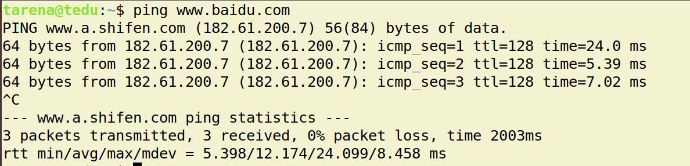
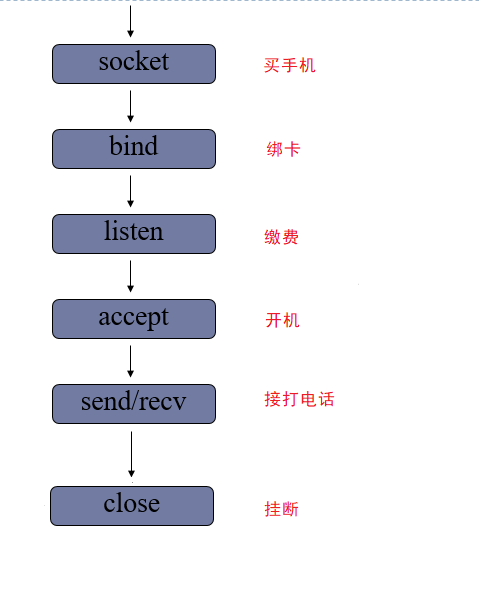
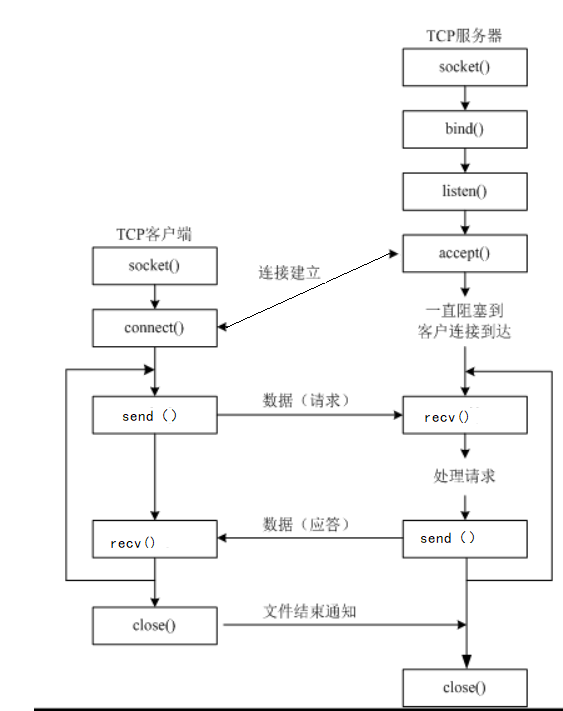
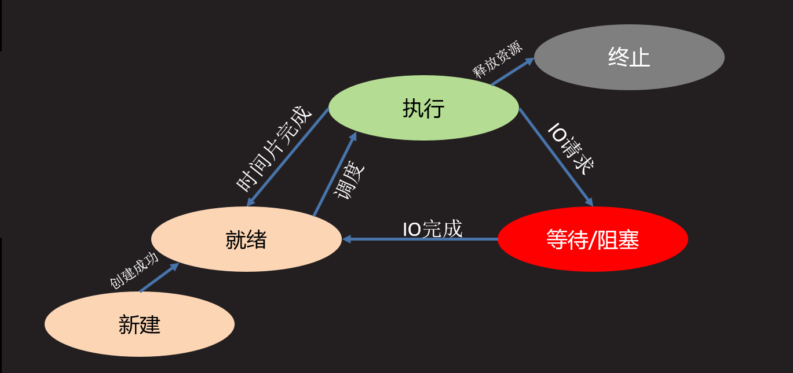
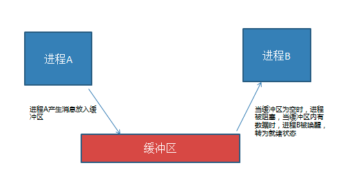
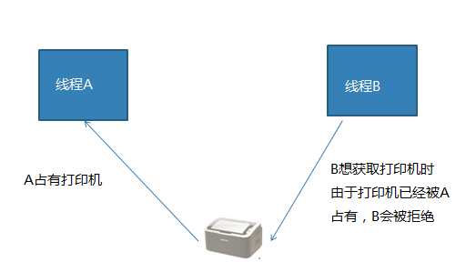

并发网络编程
==========================

| Tedu Python 教学部 |
| --- |
| Author：吕泽|

-----------

[TOC]


## 1. 网络编程

### 1.1 网络基础知识


#### 1.1.1 什么是网络

* 什么是网络 : 计算机网络功能主要包括实现资源共享，实现数据信息的快速传递。

  

  

#### 1.1.2 网络通信标准

* 面临问题

  1. 不同的国家和公司都建立自己的通信标准不利于网络互连
  2. 多种标准并行情况下不利于技术的发展融合

  


* OSI 7层模型

  

  * 好处

    1. 建立了统一的通信标准

    2. 降低开发难度，每层功能明确，各司其职

    3. 七层模型实际规定了每一层的任务，该完成什么事情

    

* TCP/IP模型

  * 七层模型过于理想，结构细节太复杂
  * 在工程中应用实践难度大
  * 实际工作中以TCP/IP模型为工作标准流程

  
         

* 网络协议

  * 什么是网络协议：在网络数据传输中，都遵循的执行规则。

  * 网络协议实际上规定了每一层在完成自己的任务时应该遵循什么规范。


* 需要应用工程师做的工作 ： 编写应用工功能，明确对方地址，选择传输服务。

    

#### 1.1.3  通信地址


* IP地址

  * IP地址 ： 即在网络中标识一台计算机的地址编号。

  * IP地址分类

    * IPv4 ： 192.168.1.5 
    * IPv6 ：fe80::80a:76cf:ab11:2d73

  * IPv4 特点

    * 分为4个部分，每部分是一个整数，取值分为0-255

  * IPv6 特点（了解）

    * 分为8个部分，每部分4个16进制数，如果出现连续的数字 0 则可以用 ：：省略中间的0

  * IP地址相关命令

    * ifconfig : 查看Linux系统下计算机的IP地址

      

    * ping  [ip]：查看计算机的连通性 

      

  * 公网IP和内网IP

    * 公网IP指的是连接到互联网上的公共IP地址，大家都可以访问。（将来进公司，公司会申请公网IP作为网络项目的被访问地址）
    * 内网IP指的是一个局域网络范围内由网络设备分配的IP地址。

  

* 端口号

  * 端口：网络地址的一部分，在一台计算机上，每个网络程序对应一个端口。

    

  * 端口号特点

    * 取值范围： 0 —— 65535 的整数
    * 一台计算机上的网络应用所使用的端口不会重复
    * 通常 0——1023 的端口会被一些有名的程序或者系统服务占用，个人一般使用 > 1024的端口

#### 1.1.4 服务端与客户端

* 服务端（Server）：服务端是为客户端服务的，服务的内容诸如向客户端提供资源，保存客户端数据，处理客户端请求等。

* 客户端（Client） ：也称为用户端，是指与服务端相对应，为客户提供一定应用功能的程序，我们平时使用的手机或者电脑上的程序基本都是客户端程序。

  


### 1.2 UDP 传输方法

#### 1.2.1 套接字简介

* 套接字(Socket) ： 实现网络编程进行数据传输的一种技术手段,网络上各种各样的网络服务大多都是基于 Socket 来完成通信的。

  

* Python套接字编程模块：import  socket


#### 1.2.3  UDP套接字编程

* 创建套接字

```python
    sock=socket.socket(family,type)
    功能：创建套接字
    参数：family  网络地址类型 AF_INET表示ipv4
         type  套接字类型 SOCK_DGRAM 表示udp套接字 （也叫数据报套接字） 
    返回值： 套接字对象
```


* 绑定地址
  * 本地地址 ： 'localhost' , '127.0.0.1'
  * 网络地址 ： '172.40.91.185' （通过ifconfig查看）
  * 自动获取地址： '0.0.0.0'


```python
    sock.bind(addr)
    功能： 绑定本机网络地址
    参数： 二元元组 (ip,port)  ('0.0.0.0',8888)
```

* 消息收发

```python		    
    data,addr = sock.recvfrom(buffersize)
    功能： 接收UDP消息
    参数： 每次最多接收多少字节
    返回值： data  接收到的内容
            addr  消息发送方地址

    n = sock.sendto(data,addr)
    功能： 发送UDP消息
    参数： data  发送的内容 bytes格式
          addr  目标地址
    返回值：发送的字节数
```

* 关闭套接字

```python
    sock.close()
    功能：关闭套接字
```

```sql
UDP服务端代码示例：

"""
udp_server.py
udp服务端实例代码
重点代码 ！！！
"""
from socket import *

# 创建UDP套接字
udp_socket = socket(AF_INET,SOCK_DGRAM)

#  绑定地址
udp_socket.bind(("0.0.0.0",8888))

while True:
    # 接收发送消息  data--> bytes
    data,addr = udp_socket.recvfrom(5)
    # if data == b"##":
    #     break
    print("从",addr,"收到:",data.decode())

    # 发送给刚才收到的地址
    udp_socket.sendto(b"Thanks",addr)

# 关闭套接字
udp_socket.close()

```

```python
UDP 客户端代码示例：
"""
udp_client.py
udp 客户端示例
重点代码！！
"""
from socket import *

# 服务器地址
ADDR = ("127.0.0.1",8888)

# 与服务端相同套接字
udp_socket = socket(AF_INET,SOCK_DGRAM)

# 发送消息
while True:
    msg = input(">>")
    if not msg:
        break

    udp_socket.sendto(msg.encode(),ADDR)
    # 结束发送
    # if msg == "##":
    #     break

    data,addr = udp_socket.recvfrom(128)
    print("从服务端收到:",data.decode())

udp_socket.close()
```


* 服务端客户端流程

  


```python
随堂练习：

使用udp完成网络单词查询
从客户端输入单词，发送给服务端，得到单词的解释，打印出来
利用 dict 数据库下的 words表来完成

########################## 服务端 ###############################
from socket import *
import pymysql


# 数据处理类
class Dict:
    def __init__(self):
        self.kwargs = {
            "host": "localhost",
            "port": 3306,
            "user": "root",
            "password": "123456",
            "database": "dict",
            "charset": "utf8"
        }
        self.connect()

    # 完成数据库连接
    def connect(self):
        self.db = pymysql.connect(**self.kwargs)
        self.cur = self.db.cursor()

    # 关闭
    def close(self):
        self.cur.close()
        self.db.close()

    def get_mean(self, word):
        sql = "select mean from words where word=%s;"
        self.cur.execute(sql, [word])
        mean = self.cur.fetchone()  # （mean,） None
        if mean:
            return mean[0]
        else:
            return "Not Found"


# 逻辑处理 网络搭建
class QueryWord:
    def __init__(self, host="0.0.0.0", port=8888):
        self.host = host
        self.port = port
        self.dict = Dict()
        self.sock = self.create_socket()

    def create_socket(self):
        sock = socket(AF_INET, SOCK_DGRAM)
        sock.bind((self.host, self.port))
        return sock

    def close(self):
        self.sock.close()

    # 查找单词方法
    def query_word(self):
        while True:
            word, addr = self.sock.recvfrom(128)
            # 查询单词
            mean = self.dict.get_mean(word.decode())

            self.sock.sendto(mean.encode(), addr)


if __name__ == '__main__':
    query = QueryWord()
    query.query_word()

    
############################ 客户端代码#########################
from socket import *

# 服务器地址
ADDR = ("127.0.0.1",8888)

class QueryWord:
    def __init__(self):
        self.sock = socket(type=SOCK_DGRAM)

    def close(self):
        self.sock.close()

    # 网络传输
    def recv_mean(self,word):
        self.sock.sendto(word.encode(),ADDR)
        mean,addr = self.sock.recvfrom(1024)
        return mean.decode()

    # 输入输出
    def query_word(self):
        while True:
            word = input("Word:")
            if not word:
                break
            mean = self.recv_mean(word)
            print("%s : %s"%(word,mean))


if __name__ == '__main__':
    query = QueryWord()
    query.query_word() # 查单词
    query.close()
```


#### 1.2.4  UDP套接字特点

* 可能会出现数据丢失的情况
* 传输过程简单，实现容易
* 数据以数据包形式表达传输
* 数据传输效率较高


### 1.3 TCP 传输方法


#### 1.3.1 TCP传输特点


* 面向连接的传输服务
  * 传输特征 ： 提供了可靠的数据传输，可靠性指数据传输过程中无丢失，无失序，无差错，无重复。
  * 可靠性保障机制（都是操作系统网络服务自动帮应用完成的）： 
    * 在通信前需要建立数据连接
    * 确认应答机制
    * 通信结束要正常断开连接

* 三次握手（建立连接）
  * 客户端向服务器发送消息报文请求连接
  * 服务器收到请求后，回复报文确定可以连接
  * 客户端收到回复，发送最终报文连接建立


					

* 四次挥手（断开连接）
  * 主动方发送报文请求断开连接
  * 被动方收到请求后，立即回复，表示准备断开
  * 被动方准备就绪，再次发送报文表示可以断开
  * 主动方收到确定，发送最终报文完成断开


#### 1.3.2 TCP服务端





- 创建套接字

```python
    sock=socket.socket(family,type)
    功能：创建套接字
    参数：family  网络地址类型 AF_INET表示ipv4
         type  套接字类型 SOCK_STREAM 表示tcp套接字 （也叫流式套接字） 
    返回值： 套接字对象
```

- 绑定地址 （与udp套接字相同）


* 设置监听

```python
    sock.listen(n)
    功能 ： 将套接字设置为监听套接字，确定监听队列大小
    参数 ： 监听队列大小
```


* 处理客户端连接请求

```python
    conn,addr = sockfd.accept()
    功能： 阻塞等待处理客户端请求
    返回值： conn  客户端连接套接字
            addr  连接的客户端地址
```

* 消息收发

```python
    data = conn.recv(buffersize)
    功能 : 接受客户端消息
    参数 ：每次最多接收消息的大小
    返回值： 接收到的内容

    n = conn.send(data)
    功能 : 发送消息
    参数 ：要发送的内容  bytes格式
    返回值： 发送的字节数
```

6. 关闭套接字 (与udp套接字相同)

```python
TCP服务端示例01：

"""
TCP服务端函数示例
重点代码 ！！
"""
from socket import *

# 创建tcp套接字
tcp_socket = socket(AF_INET,SOCK_STREAM)

# 绑定地址
tcp_socket.bind(("0.0.0.0",8888))

# 设置为监听套接字
tcp_socket.listen(5)

# 等待客户端连接
while True:
    print("Waiting for connect...")
    connfd,addr = tcp_socket.accept()
    print("Connect from",addr)

    # 循环收发消息  客户端退出 recv立即返回b""
    while True:
        data = connfd.recv(5)
        # data=b""客户端直接关闭  b"##"客户端主动告知关闭
        if not data or data == b'##':
            break
        print("收到:",data.decode())
        connfd.send(b"Thanks/")
    connfd.close()

# 关闭套接字
tcp_socket.close()
```


#### 1.3.3 TCP客户端 


* 创建TCP套接字
* 请求连接

```python
    sock.connect(server_addr)
    功能：连接服务器
    参数：元组  服务器地址
```

* 收发消息

> 注意： 防止两端都阻塞，recv send要配合

* 关闭套接字

  

  ```python
  TCP客户端示例01：
  """
  TCP套接字编程 客户端
  重点代码 ！！
  """
  from socket import *
  
  # 服务端地址
  ADDR = ("127.0.0.1",8888)
  
  # 使用默认值--》tcp
  tcp_socket = socket()
  
  # 发起连接
  tcp_socket.connect(ADDR)
  
  # 循环发送接收消息
  while True:
      msg = input(">>")
      tcp_socket.send(msg.encode())
      # 结束发送
      if msg == "##":
          break
      data = tcp_socket.recv(1024)
      print("From server:",data.decode())
  
  tcp_socket.close()
  ```

  




```python
随堂练习：
在客户端将一张图片上传到服务端，图片自选，上传到服务端后命名为 recv.jpg

思路： 客户端   获取文件内容--》发送出去
      服务端   接收文件内容--》写入磁盘
    
########################## 服务端部分 #####################
from  socket import *

# 接收内容，写入文件
def recv_file(connfd):
    file = open("recv.jpg",'wb')
    # 边收边写
    while True:
        data = connfd.recv(1024)
        if data == b"##":
            break
        file.write(data)
    file.close()
    connfd.send("上传完毕".encode())


def main():
    # 创建tcp套接字
    tcp_socket = socket()
    tcp_socket.bind(("0.0.0.0",8888))
    tcp_socket.listen(5)

    while True:
        connfd,addr = tcp_socket.accept()
        print("Connect from",addr)
        # 接收文件
        recv_file(connfd)
        connfd.close()

if __name__ == '__main__':
    main()
    
############################ 客户端部分 ###################################

from socket import *

def send_file(tcp_socket,filename):
    file = open(filename,"rb")
    # 边读边发送
    while True:
        data = file.read(1024)
        if not data:
            break
        tcp_socket.send(data)
    file.close()
    tcp_socket.send(b"##") # 告知服务端结束
    msg = tcp_socket.recv(128)
    print(msg.decode())

def main(filename):
    tcp_socket = socket()
    tcp_socket.connect(("127.0.0.1",8888))
    # 发送文件
    send_file(tcp_socket,filename)
    tcp_socket.close()

if __name__ == '__main__':
    main("./zly.jfif")
```


```python
TCP服务端示例02：

from socket import *

# 创建tcp套接字
tcp_socket = socket(AF_INET,SOCK_STREAM)

# 绑定地址
tcp_socket.bind(("0.0.0.0",8880))

# 设置为监听套接字
tcp_socket.listen(5)

# 循环连接 收发 断开 -》 每次发送消息都需要连接
while True:
    connfd,addr = tcp_socket.accept()

    data = connfd.recv(1024)
    print("收到:",data.decode())
    connfd.send(b"Thanks")
    connfd.close()

# 关闭套接字
tcp_socket.close()
```

```python
TCP客户端示例02：

from socket import *

# 服务端地址
ADDR = ("127.0.0.1",8880)

# 循环发送接收消息
while True:
    msg = input(">>")
    if not msg:
        break
    tcp_socket = socket()
    tcp_socket.connect(ADDR)
    tcp_socket.send(msg.encode())
    data = tcp_socket.recv(1024)
    print("From server:",data.decode())
    tcp_socket.close()
```


#### 1.3.4 TCP套接字细节

* tcp连接中当一端退出，另一端如果阻塞在recv，此时recv会立即返回一个空字串。

* tcp连接中如果一端已经不存在，仍然试图通过send向其发送数据则会产生BrokenPipeError

* 一个服务端可以同时连接多个客户端，也能够重复被连接

* tcp粘包问题

  * 产生原因

    * 为了解决数据再传输过程中可能产生的速度不协调问题，操作系统设置了缓冲区
    * 实际网络工作过程比较复杂，导致消息收发速度不一致
    * tcp以字节流方式进行数据传输，在接收时不区分消息边界

    

  * 带来的影响

    * 如果每次发送内容是一个独立的含义，需要接收端独立解析此时粘包会有影响。

  * 处理方法

    * 消息格式化处理，如人为的添加消息边界，用作消息之间的分割
    * 控制发送的速度

```python
随堂练习：
在客户端有一些数据
data = [
  "张三  18   177",
  "李四  19   180",
  "王五  120  183"
]
从客户端向服务端发送这些数据，在服务端将这些数据分别写入到一个文件中，每个数据占一行
客户端发送完成是 向服务端发送 '#' 表示发送完毕

######################### 服务端 ######################
from socket import *

# 接收数据 (对应客户端方法1)
# def recv_data(connfd):
#     file = open("student.txt",'w')
#     while True:
#         data = connfd.recv(1024).decode()
#         if data == '##':
#             break
#         file.write(data + '\n')
#     file.close()

# 接收数据 (对应客户端方法2)
def recv_data(connfd):
    file = open("student.txt", 'wb')
    # data--> xxxx\nxxxx\nxxxx\n
    data = connfd.recv(1024 * 1024)
    file.write(data)
    file.close()

def main():
    sock = socket()
    sock.bind(("0.0.0.0",8888))
    sock.listen(3)
    connfd,addr = sock.accept()
    print("连接:",addr)
    recv_data(connfd) # 接收数据

if __name__ == '__main__':
    main()

    
###################### 客户端  ################################

from socket import *
from time import sleep

data = [
  "张三  18   177",
  "李四  19   180",
  "王五  120  183"
]

# 发送数据  (处理粘包方法1)
# def send_data(sock):
#     for item in data:
#         sock.send(item.encode())
#         sleep(0.1) # 延迟发送
#     sock.send(b"##") #   表示发送完成

# 发送数据  (处理粘包方法2)
def send_data(sock):
    info = '\n'.join(data)
    sock.send(info.encode()) # 一次性发送

def main():
    sock = socket()
    sock.connect(("127.0.0.1",8888))
    send_data(sock) # 发送数据
    sock.close()

if __name__ == '__main__':
    main()
```


#### 1.3.5 TCP与UDP对比

* 传输特征
  * TCP提供可靠的数据传输，但是UDP则不保证传输的可靠性
  * TCP传输数据处理为字节流，而UDP处理为数据包形式
  * TCP传输需要建立连接才能进行数据传，效率相对较低，UDP比较自由，无需连接，效率较高

* 套接字编程区别
  * 创建的套接字类型不同
  * tcp套接字会有粘包，udp套接字有消息边界不会粘包
  * tcp套接字依赖listen accept建立连接才能收发消息，udp套接字则不需要
  * tcp套接字使用send，recv收发消息，udp套接字使用sendto，recvfrom
* 使用场景
  * tcp更适合对准确性要求高，传输数据较大的场景
    * 文件传输：如下载电影，访问网页，上传照片
    * 邮件收发
    * 点对点数据传输：如点对点聊天，登录请求，远程访问，发红包
  * udp更适合对可靠性要求没有那么高，传输方式比较自由的场景
    * 视频流的传输： 如部分直播，视频聊天等
    * 广播：如网络广播，群发消息
    * 实时传输：如游戏画面
  * 在一个大型的项目中，可能既涉及到TCP网络又有UDP网络

```python
随堂练习：
完成一个对话小程序，客户端可以发送问题给服务端，服务端接收到问题将对应答案给客户端，客户端打印出来
要求可以同时多个客户端提问，如果问题没有指定答案，则回答 “人家还小，不知道。”

注意： 不需要使用数据库文件存储应答内容，在服务端用字典表示关键字和答案之间的对应关系即可
{"key":"value"}
key: 几岁
value ： 我2岁啦

################ 服务端 ############################
from socket import *

# 对话字典
chat = {
    "你好":"你好啊！",
    "叫什么":"我叫小美",
    "男生女生":"我是机器人啦",
    "你几岁":"我2岁啦"
}

def handle(connfd):
    # q 客户端问题
    q = connfd.recv(1024).decode()
    for key,value in chat.items():
        if key in q:
            connfd.send(value.encode())
            break
    else:
        connfd.send("人家还小不知道啦。".encode())

def main():
    sock = socket()
    sock.bind(("0.0.0.0",8888))
    sock.listen(5)
    # 循环处理对话
    while True:
        connfd,addr = sock.accept()
        handle(connfd) # 接收问题回答问题
        connfd.close()

if __name__ == '__main__':
    main()


#######################  客户端  ###############################
from socket import *

# 服务器地址
ADDR = ("127.0.0.1",8888)

def chat(msg):
    sock = socket()
    sock.connect(ADDR)
    sock.send(msg.encode())
    result = sock.recv(1024)
    sock.close()
    return result.decode()

# 创建套接字
def main():
    while True:
        msg = input("我：")
        if not msg:
            break
        result = chat(msg)
        print("小美：",result)

if __name__ == '__main__':
    main()
```


### 1.4 数据传输过程


#### 1.4.1 传输流程

* 发送端由应用程序发送消息，逐层添加首部信息，最终在物理层发送消息包。
* 发送的消息经过多个节点（交换机，路由器）传输，最终到达目标主机。
* 目标主机由物理层逐层解析首部消息包，最终到应用程序呈现消息。


#### 1.4.2 TCP协议首部信息


* 源端口和目的端口 各占2个字节，分别写入源端口和目的端口。

* 序号 占4字节。TCP是面向字节流的。在一个TCP连接中传送的字节流中的每一个字节都按顺序编号。例如，一报文段的序号是301，而接待的数据共有100字节。这就表明本报文段的数据的第一个字节的序号是301，最后一个字节的序号是400。

* 确认号 占4字节，是期望收到对方下一个报文段的第一个数据字节的序号。例如，B正确收到了A发送过来的一个报文段，其序号字段值是501，而数据长度是200字节（序号501~700），这表明B正确收到了A发送的到序号700为止的数据。因此，B期望收到A的下一个数据序号是701，于是B在发送给A的确认报文段中把确认号置为701。

* 确认ACK（ACKnowledgment） 仅当ACK = 1时确认号字段才有效，当ACK = 0时确认号无效。TCP规定，在连接建立后所有的传送的报文段都必须把ACK置为1。

* 同步SYN（SYNchronization） 在连接建立时用来同步序号。当SYN=1而ACK=0时，表明这是一个连接请求报文段。对方若同意建立连接，则应在响应的报文段中使SYN=1和ACK=1，因此SYN置为1就表示这是一个连接请求或连接接受报文。

* 终止FIN（FINis，意思是“完”“终”） 用来释放一个连接。当FIN=1时，表明此报文段的发送发的数据已发送完毕，并要求释放运输连接。


## 2. 多任务编程

### 2.1 多任务概述

* 多任务

   即操作系统中可以同时运行多个任务。比如我们可以同时挂着qq，听音乐，同时上网浏览网页。这是我们看得到的任务，在系统中还有很多系统任务在执行,现在的操作系统基本都是多任务操作系统，具备运行多任务的能力。

  

  

  


* 计算机原理 

  * CPU：计算机硬件的核心部件，用于对任务进行执行运算。

    

  * 操作系统调用CPU执行任务

    

  * cpu轮询机制 ： cpu都在多个任务之间快速的切换执行，切换速度在微秒级别，其实cpu同时只执行一个任务，但是因为切换太快了，从应用层看好像所有任务同时在执行。

    

  * 多核CPU：现在的计算机一般都是多核CPU，比如四核，八核，我们可以理解为由多个单核CPU的集合。这时候在执行任务时就有了选择，可以将多个任务分配给某一个cpu核心，也可以将多个任务分配给多个cpu核心，操作系统会自动根据任务的复杂程度选择最优的分配方案。

    * 并发 ： 多个任务如果被分配给了一个cpu内核，那么这多个任务之间就是并发关系，并发关系的多个任务之间并不是真正的"同时"。
    * 并行 ： 多个任务如果被分配给了不同的cpu内核，那么这多个任务之间执行时就是并行关系，并行关系的多个任务时真正的“同时”执行。

  

* 什么是多任务编程

  多任务编程即一个程序中编写多个任务，在程序运行时让这多个任务一起运行，而不是一个一个的顺次执行。

  比如微信视频聊天，这时候在微信运行过程中既用到了视频任务也用到了音频任务，甚至同时还能发消息。这就是典型的多任务。而实际的开发过程中这样的情况比比皆是。

  

  

  * 实现多任务编程的方法 ： **多进程编程，多线程编程**

  

* 多任务意义

  * 提高了任务之间的配合，可以根据运行情况进行任务创建。

    比如： 你也不知道用户在微信使用中是否会进行视频聊天，总不能提前启动起来吧，这是需要根据用户的行为启动新任务。

  * 充分利用计算机资源，提高了任务的执行效率。

    * 在任务中无阻塞时只有并行状态才能提高效率

    

    

    * 在任务中有阻塞时并行并发都能提高效率

    


### 2.2 进程（Process）

#### 2.2.1 进程概述

* 定义： 程序在计算机中的一次执行过程。

  - 程序是一个可执行的文件，是静态的占有磁盘。

  - 进程是一个动态的过程描述，占有计算机运行资源，有一定的生命周期。

    

* 进程状态

   * 三态  
       	  就绪态 ： 进程具备执行条件，等待系统调度分配cpu资源 
      
       	  运行态 ： 进程占有cpu正在运行 
      
       	  等待态 ： 进程阻塞等待，此时会让出cpu
      
      
      
   * 五态 (在三态基础上增加新建和终止)
     
       	  新建 ： 创建一个进程，获取资源的过程
      
       	  终止 ： 进程结束，释放资源的过程
      
      


* 进程命令

  * 查看进程信息

    ```shell
    ps -aux
    ```

    

    * USER ： 进程的创建者
    * PID  :  操作系统分配给进程的编号,大于0的整数，系统中每个进程的PID都不重复。PID也是重要的区分进程的标志。
    * %CPU,%MEM : 占有的CPU和内存
    * STAT ： 进程状态信息，S I 表示阻塞状态  ，R 表示就绪状态或者运行状态
    * START : 进程启动时间
    * COMMAND : 通过什么程序启动的进程

  

  * 进程树形结构

    ```shell
    pstree
    ```

    * 父子进程：在Linux操作系统中，进程形成树形关系，任务上一级进程是下一级的父进程，下一级进程是上一级的子进程。

#### 2.2.2 多进程编程

* 使用模块 ： multiprocessing

* 创建流程
  
  【1】 将需要新进程执行的事件封装为函数
  
  【2】 通过模块的Process类创建进程对象，关联函数
  
  【3】 通过进程对象调用start启动进程
  
  
  
* 主要类和函数使用

```python
    Process()
    功能 ： 创建进程对象
    参数 ： target 绑定要执行的目标函数 
           args 元组，用于给target函数位置传参
           kwargs 字典，给target函数键值传参
           daemon  bool值，让子进程随父进程退出
```

```python
    p.start()
    功能 ： 启动进程
```

> 注意 : 启动进程此时target绑定函数开始执行，该函数作为新进程执行内容，此时进程真正被创建

```python
	p.join([timeout])
	功能：阻塞等待子进程退出
	参数：最长等待时间
```


```python
进程创建示例：
"""
进程创建示例 01
"""
import multiprocessing as mp
from time import sleep

a = 1   # 全局变量

# 进程目标函数
def fun():
    print("开始运行一个进程")
    sleep(4)  # 模拟事件执行事件
    global a
    print("a =",a)  # Yes
    a = 10000
    print("进程执行结束")


# 实例化进程对象
process = mp.Process(target=fun)

# 启动进程  进程产生 执行fun
process.start()

print("我也做点事情")
sleep(3)
print("我也把事情做完了...")

process.join() # 阻塞等待子进程结束
print("a:",a) # 1  10000
```


```python
"""
进程创建示例02 ： 含有参数的进程函数
"""
from multiprocessing import Process
from time import sleep

#　含有参数的进程函数
def worker(sec,name):
    for i in range(3):
        sleep(sec)
        print("I'm %s"%name)
        print("I'm working....")

#　元组位置传参
# p = Process(target=worker,args=(2,"Tom"))

# 关键字传参
p = Process(target=worker,
            args = (2,),
            kwargs={"name":"Tom"},
            daemon=True) # 子进程伴随父进程结束
p.start()
sleep(3)

```


* 进程执行现象理解 （难点）
  
  
  
  * 新的进程是原有进程的子进程，子进程复制父进程全部内存空间代码段，一个进程可以创建多个子进程。
  * 子进程只执行指定的函数，其余内容均是父进程执行内容，但是子进程也拥有其他父进程资源。
  * 各个进程在执行上互不影响，也没有先后顺序关系。
  * 进程创建后，各个进程空间独立，相互没有影响。
  * multiprocessing 创建的子进程中无法使用标准输入（即无法使用input）。


#### 2.2.3 进程处理细节


* 进程相关函数

```
    os.getpid()
    功能： 获取一个进程的PID值
    返回值： 返回当前进程的PID 
```

```
    os.getppid()
    功能： 获取父进程的PID号
    返回值： 返回父进程PID
```

```
    sys.exit(info)
    功能：退出进程
    参数：字符串 表示退出时打印内容
```

```python
"""
创建多个子进程
"""
from multiprocessing import Process
from time import sleep
import sys, os


def th1():
    sleep(3)
    print("吃饭")
    print(os.getppid(), "--", os.getpid())


def th2():
    # sys.exit("不能睡觉了") # 进程结束
    sleep(1)
    print("睡觉")
    print(os.getppid(), "--", os.getpid())


def th3():
    sleep(2)
    print("打豆豆")
    print(os.getppid(), "--", os.getpid())


# 循环创建子进程
jobs = [] # 存放每个进程对象
for th in [th1, th2, th3]:
    p = Process(target=th)
    jobs.append(p) # 存入jobs
    p.start()

#  确保三件事都结束
for i in jobs:
    i.join()
print("三件事完成")
```

```python
随堂练习：大文件拆分
有一个大文件，将其拆分成上下两个部分 （按照字节大小），要求两个部分拆分要同步进行
plus ： 假设文件很大不要一次read读取全部

提示 ： os.path.getsize() 获取文件大小
       创建两个子进程分别拆上下两个部分

import os
from multiprocessing import Process

filename = "./dict.txt"
size = os.path.getsize(filename)

# 如果父进程打开子进程直接用则会公用一个文件偏移量
# fr = open(filename,'rb')

def top():
    fr = open(filename,'rb')
    fw = open('top.txt','wb')
    n = size // 2
    while n >= 1024:
        fw.write(fr.read(1024))
        n -= 1024
    else:
        fw.write(fr.read(n))
    fr.close()
    fw.close()

def bot():
    fr = open(filename, 'rb')
    fw = open('bot.txt', 'wb')
    fr.seek(size//2,0)  # 文件偏移量到中间
    while True:
        data = fr.read(1024)
        if not data:
            break
        fw.write(data)
    fr.close()
    fw.close()

jobs=[]
for item in [top,bot]:
    p = Process(target=item)
    jobs.append(p)
    p.start()

[i.join() for i in jobs]
print("拆分完成")


```


* 孤儿进程和僵尸进程

  * 孤儿进程： 父进程先于子进程退出时，子进程会成为孤儿进程，孤儿进程会被系统自动收养，成为孤儿进程新的父进程，并在孤儿进程退出时释放其资源。

  * 僵尸进程： 子进程先于父进程退出，父进程又没有处理子进程的退出状态，此时子进程就会成为僵尸进程。

    特点： 僵尸进程虽然结束，但是会存留部分进程资源在内存中，大量的僵尸进程会浪费系统资源。Python模块当中自动建立了僵尸处理机制，每次创建新进程都进行检查，将之前产生的僵尸处理掉，而且父进程退出前，僵尸也会被自动处理。

  

  

#### 2.2.4 创建进程类

进程的基本创建方法将子进程执行的内容封装为函数。如果我们更热衷于面向对象的编程思想，也可以使用类来封装进程内容。

* 创建步骤
  
  【1】 继承Process类
  
  【2】 重写`__init__`方法添加自己的属性，使用super()加载父类属性
  
  【3】 重写run()方法
  
  
  
* 使用方法
  
  【1】 实例化对象
  
  【2】 调用start自动执行run方法
  
  
  
  ```python
  """
  自定义进程类
  """
  from multiprocessing import Process
  from time import sleep
  
  
  class MyProcess(Process):
      def __init__(self, value):
          self.value = value
          super().__init__()  # 调用父类的init
  
      # 重写run 作为进程的执行内容
      def run(self):
          for i in range(self.value):
              sleep(2)
              print("自定义进程类。。。。")
  
  p = MyProcess(3)
  p.start() # 将 run方法作为进程执行
  ```
  
  ```python
  随堂练习：
  1. 求100000以内质数之和，并且计算这个求和过程的时间
  
  2. 将100000分成4份，创建4个进程，每个进程求其中一份的
  质数之和，统计4个进程执行完的时间
  
  提示： 
  质数: 只能被1和其本身整除的整数 >1
  import time  time.time()
  
  import time
  from multiprocessing import Process
  
  # 求begin -- end 之间的质数之和
  class Prime(Process):
      @staticmethod
      def is_prime(n):
          if n <= 1:
              return False
          for i in range(2, n // 2 + 1):
              if n % i == 0:
                  return False
          return True
  
      def __init__(self,begin,end):
          self.begin = begin # 起始数字
          self.end = end # 结尾数字
          super().__init__()
  
      def run(self):
          prime = []  # 存放所有质数
          for i in range(self.begin,self.end):
              if Prime.is_prime(i):
                  prime.append(i)  # 存入列表
          print(sum(prime))
  
  if __name__ == '__main__':
      # 4进程 用时: 9.434056282043457
      # 10进程 用时: 8.70681643486023
      jobs = []
      b = time.time()
      for i in range(1,100001,10000):
          p = Prime(i,i + 10000)
          jobs.append(p)
          p.start()
      [i.join() for i in jobs]
      print("用时:",time.time()-b)
  
  
  
  # def is_prime(n):
  #     if n <= 1:
  #         return False
  #     for i in range(2,n // 2 + 1):
  #         if n % i == 0:
  #             return False
  #     return True
  
  # def prime_sum():
  #     prime = [] # 存放所有质数
  #     for i in range(100001):
  #         if is_prime(i):
  #             prime.append(i)  # 存入列表
  #     print(sum(prime))
  
  # 用时： 16.357502222061157
  # begin = time.time()
  # prime_sum()
  # print("用时：",time.time()-begin)
  ```
  
  

#### 2.2.5 进程间通信

* 必要性： 进程间空间独立，资源不共享，此时在需要进程间数据传输时就需要特定的手段进行数据通信。
* 常用进程间通信方法：消息队列，套接字等。

* 消息队列使用
  * 通信原理： 在内存中开辟空间，建立队列模型，进程通过队列将消息存入，或者从队列取出完成进程间通信。
  * 实现方法

	```python
	from multiprocessing import Queue
	
	q = Queue(maxsize=0)
	功能: 创建队列对象
	参数：最多存放消息个数
	返回值：队列对象
	
	q.put(data)
	功能：向队列存入消息
	参数：data  要存入的内容
	
	q.get()
	功能：从队列取出消息
	返回值： 返回获取到的内容
	
	q.full()   判断队列是否为满
	q.empty()  判断队列是否为空
	q.qsize()  获取队列中消息个数
	q.close()  关闭队列
	```

```python
进程间通信示例：
from multiprocessing import Process,Queue

# 创建消息队列
q = Queue(5)

# 子进程函数
def handle():
    while True:
        cmd = q.get() # 取出指令
        if cmd == "1":
            print("\n完成指令1")
        elif cmd == "2":
            print("\n完成指令2")

# 创建进程
p = Process(target=handle,daemon=True)
p.start()

while  True:
    cmd = input("指令：")
    if not cmd:
        break
    q.put(cmd) # 通过队列给子进程

```

```python
随堂练习：
有一个目录中有若干普通文件，将该目录复制一份到当前程序所在位置
要求： 目标文件夹中每个文件复制都采用一个独立的进程完成
      当所有文件复制完成之后，按复制完成顺序打印所有文件名
提示：
创建文件夹 ： os.mkdir(dir)  os.listdir()

from multiprocessing import Process, Queue
import os

# 消息队列
q = Queue()

# 进程函数  复制文件
def copy(old,new,file):
    fr = open(old+'/'+file,'rb')
    fw = open(new+'/'+file,'wb')
    while True:
        data = fr.read()
        if not data:
            break
        fw.write(data)
    fr.close()
    fw.close()
    q.put(file) #  存入队列

# 入口函数
def main(old):
    new = old.split('/')[-1]
    os.mkdir(new)  #  创建新文件夹
    jobs = []  # 存放每个进程对象
    # 循环创建进程 file --> 文件名称
    for file in os.listdir(old):
        p = Process(target=copy,args=(old,new,file))
        jobs.append(p)
        p.start()
    [i.join() for i in jobs] # 判断所有进程结束
    print("拷贝了如下文件:")
    while q.qsize():
        print(q.get())

if __name__ == '__main__':
    main("/home/tarena/FTP")

```


**群聊聊天室 **

> 功能 ： 类似qq群功能
>
> 
>
> 【1】 有人进入聊天室需要输入姓名，姓名不能重复
>
> 【2】 有人进入聊天室时，其他人会收到通知：**Lucy 进入了聊天室**
>
> 【3】 一个人发消息，其他人会收到：   **Lucy ： 一起出去玩啊。**
>
> 【4】 有人退出聊天室，则其他人也会收到通知 :  **Lucy 退出了聊天室**
>
> 【5】 扩展功能：服务器可以向所有用户发送公告:    **管理员消息： 大家好，欢迎进入聊天室。**
>
> 

```python
################ 服务端参考代码 ###################
from socket import *
from multiprocessing import Process

# 服务器地址
HOST = "0.0.0.0"
PORT = 8888
ADDR = (HOST, PORT)

# 存储用户信息 {name:address}
user = {}


# 处理进入聊天室
def login(sock, name, address):
    if name in user or "管理" in name:
        sock.sendto(b"FAIL", address)
    else:
        sock.sendto(b"OK", address)
        # 告知其他人
        msg = "欢迎 %s 进入聊天室" % name
        for key, value in user.items():
            sock.sendto(msg.encode(), value)
        user[name] = address  # 存储用户
        # print(user)  # 测试


# 处理聊天
def chat(sock, name, content):
    msg = "%s : %s" % (name, content)
    for key, value in user.items():
        # 不是本人就发送
        if key != name:
            sock.sendto(msg.encode(), value)


# 处理退出
def exit(sock, name):
    if name in user:
        del user[name]  # 删除该用户
    # 通知其他用户
    msg = "%s 退出聊天室" % name
    for key, value in user.items():
        sock.sendto(msg.encode(), value)


def handle(sock):
    # 不断接收请求，分情况讨论
    while True:
        request, addr = sock.recvfrom(1024)
        tmp = request.decode().split(" ", 2)
        # 分情况讨论
        if tmp[0] == "LOGIN":
            # tmp ->[LOGIN,name]
            login(sock, tmp[1], addr)
        elif tmp[0] == "CHAT":
            # tmp ->[CHAT,name,content]
            chat(sock, tmp[1], tmp[2])
        elif tmp[0] == "EXIT":
            # tmp ->[EXIT,name]
            exit(sock, tmp[1])


# 程序入口函数
def main():
    # 创建udp
    sock = socket(AF_INET, SOCK_DGRAM)
    sock.bind(ADDR)

    # 接收请求，分类处理
    p = Process(target=handle, args=(sock,), daemon=True)
    p.start()

    while True:
        content = input("管理员消息:")
        if not content:
            break
        msg = "CHAT 管理员消息 " + content
        # 从父进程发送到子进程
        sock.sendto(msg.encode(), ADDR)


if __name__ == '__main__':
    main()

    
################## 客户端参考代码 ##################
from socket import *
from multiprocessing import Process
import sys

# 服务器地址
SERVER_ADDR = ("124.71.188.218", 8888)


def login(sock):
    while True:
        name = input("请输入昵称:")
        # 组织请求
        msg = "LOGIN " + name
        sock.sendto(msg.encode(), SERVER_ADDR)
        result, addr = sock.recvfrom(1024)
        if result == b"OK":
            print("进入聊天室")
            return name
        else:
            print("该昵称已存在")


# 子进程接收函数
def recv_msg(sock):
    while True:
        data, addr = sock.recvfrom(1024 * 10)
        # 格式处理
        content = "\n" + data.decode() + "\n发言："
        print(content, end="")


# 　父进程发送函数
def send_msg(sock, name):
    while True:
        try:
            content = input("发言：")
        except KeyboardInterrupt:
            content = "exit"
        # 表示退出
        if content == 'exit':
            msg = "EXIT " + name
            sock.sendto(msg.encode(), SERVER_ADDR)
            sys.exit("您已退出聊天室")
        msg = "CHAT %s %s" % (name, content)
        sock.sendto(msg.encode(), SERVER_ADDR)


def main():
    sock = socket(AF_INET, SOCK_DGRAM)
    sock.bind(("0.0.0.0",55224)) # 端口不要变
    name = login(sock)  # 请求进入聊天室
    # 子进程负责接收
    p = Process(target=recv_msg, args=(sock,), daemon=True)
    p.start()
    send_msg(sock, name)  # 发送消息


if __name__ == '__main__':
    main()

```


### 2.3 线程 (Thread)


#### 2.3.1 线程概述

* 什么是线程
  
  【1】 线程被称为轻量级的进程，也是多任务编程方式
  
  【2】 也可以利用计算机的多cpu资源
  
  【3】 线程可以理解为进程中再开辟的分支任务

  

* 线程特征
  
  【1】 一个进程中可以包含多个线程
  
  【2】 线程也是一个运行行为，消耗计算机资源
  
  【3】 一个进程中的所有线程共享这个进程的资源
  
  【4】 多个线程之间的运行同样互不影响各自运行
  
  【5】 线程的创建和销毁消耗资源远小于进程

  

  

#### 2.3.2 多线程编程

* 线程模块： threading


* 创建方法

  【1】 创建线程对象

```python
from threading import Thread 

t = Thread()
功能：创建线程对象
参数：target 绑定线程函数
     args   元组 给线程函数位置传参
     kwargs 字典 给线程函数键值传参
     daemon bool值，主线程推出时该分支线程也推出
```

	【2】 启动线程

```
 t.start()
```

	【3】等待分支线程结束

```
t.join([timeout])
功能：阻塞等待分支线程退出
参数：最长等待时间
```

```python
线程示例01：

import threading
from time import sleep
import os

a = 1

#  线程函数
def music():
    global a
    print("a =",a)
    a = 10000
    for i in range(3):
        sleep(2)
        print(os.getpid(),"播放:黄河大合唱")

# 实例化线程对象
thread = threading.Thread(target=music)
# 启动线程 线程存在
thread.start()

for i in range(4):
    sleep(1)
    print(os.getpid(),"播放:葫芦娃")

# 阻塞等待分支线程结束
thread.join()
print("a:",a)
```

```python
线程示例02：

from threading import Thread
from time import sleep

# 带有参数的线程函数
def func(sec,name):
    print("含有参数的线程来喽")
    sleep(sec)
    print("%s 线程执行完毕"%name)

# 循环创建线程
for i in range(5):
    t = Thread(target=func,
               args=(2,),
               kwargs={"name":"T-%d"%i},
               daemon=True)
    t.start()
```


#### 2.3.3 创建线程类

1. 创建步骤
   
   【1】 继承Thread类
   
   【2】 重写`__init__`方法添加自己的属性，使用super()加载父类属性
   
   【3】 重写run()方法
   
   
   
2. 使用方法

   【1】 实例化对象

   【2】 调用start自动执行run方法
   
   ```python
   from threading import Thread
   from time import sleep
   
   class MyThread(Thread):
       def __init__(self,song):
           self.song = song
           super().__init__() # 得到父类内容
   
       # 线程要做的事情
       def run(self):
           for i in range(3):
               sleep(2)
               print("播放:",self.song)
   
   t = MyThread("凉凉")
   t.start() # 运行run
   ```
   
   ```python
   随堂练习：
   现在有500张票，存在一个列表中 ["T1",...."T500"]，10个窗口同时卖这500张票 W1-W10
   
   使用10个线程模拟这10个窗口，同时卖票，直到所有的票都卖出为止，每出一张票 需要0.1秒，打印表示即可print("W1----T250")
   
   from threading import Thread,Lock
   from time import sleep
   
   lock = Lock() # 创建锁
   
   # 将票准备好
   ticket = ["T%d" % x for x in range(1, 501)]
   
   # 线程函数 w:表示窗口
   def sell(w):
       while ticket:
           print("%s --- %s"%(w,ticket.pop(0)))
           sleep(0.1)
   
   # 10个线程
   for i in range(1,11):
       t = Thread(target=sell,args=("W%d"%i,))
       t.start()
   ```
   
   


#### 2.3.4 线程同步互斥

* 线程通信方法： 线程间使用全局变量进行通信

* 共享资源争夺
  * 共享资源：多线程都可以操作的资源称为共享资源。对共享资源的操作代码段称为临界区。
  * 影响 ： 对共享资源的无序操作可能会带来数据的混乱，或者操作错误。此时往往需要同步互斥机制协调操作顺序。

* 同步互斥机制

  * 同步 ： 同步是一种协作关系，为完成操作，线程间形成一种协调，按照必要的步骤有序执行操作。

    

  * 互斥 ： 互斥是一种制约关系，当一个进程或者线程占有资源时会进行加锁处理，此时其他进程线程就无法操作该资源，直到解锁后才能操作。




* 线程Event

```python		  
from threading import Event

e = Event()  创建线程event对象

e.wait([timeout])  阻塞等待e被set

e.set()  设置e，使wait结束阻塞

e.clear() 使e回到未被设置状态

e.is_set()  查看当前e是否被设置
```

```python
Event使用示例：

from threading import Thread, Event

msg = None  # 通信变量
e = Event()  # 事件对象


def 杨子荣():
    print("杨子荣前来拜山头")
    global msg
    msg = "天王盖地虎"
    e.set()  # 通知主线程可以判断


t = Thread(target=杨子荣)
t.start()

print("说对口令才是自己人")
e.wait()  # 阻塞等待通知
if msg == "天王盖地虎":
    print("宝塔镇河妖")
    print("确认过眼神你是对的人")
else:
    print("打死他.... 无情啊 哥哥....")

```


* 线程锁 Lock

```python
from  threading import Lock

lock = Lock()  创建锁对象
lock.acquire() 上锁  如果lock已经上锁再调用会阻塞
lock.release() 解锁
```

```python
Lock使用示例：

from threading import Thread, Lock

lock = Lock() #　创建锁
a = b = 0

def value():
    while True:
        lock.acquire() # 上锁
        if a != b:
            print("a = %d,b = %d" % (a, b))
        lock.release() # 解锁

t = Thread(target=value)
t.start()

while True:
    lock.acquire()
    a += 1
    b += 1
    lock.release()

```

```python
随堂练习：
使用两个分支线程，一个线程打印1-52 这52个数字，另一个线程打印A-Z 这26个字母。要求同时执行两个线程，打印顺序为： 12A34B....5152Z

from threading import Thread,Lock

lock1 = Lock()
lock2 = Lock()

def print_num():
    for i in range(1,53,2):
        lock1.acquire()
        print(i)
        print(i + 1)
        lock2.release()

def print_chr():
    for i in range(65,91):
        lock2.acquire()
        print(chr(i))
        lock1.release()


t1 = Thread(target=print_num)
t2 = Thread(target=print_chr)

lock2.acquire() # 先把打印字母的部分锁住

t1.start()
t2.start()
```


#### 2.3.5 死锁

* 什么是死锁

  死锁是指两个或两个以上的线程在执行过程中，由于竞争资源或者由于彼此通信而造成的一种阻塞的现象，若无外力作用，它们都将无法推进下去。此时称系统处于死锁状态或系统产生了死锁。


* 死锁产生条件

  * 互斥条件：指线程使用了互斥方法，使用一个资源时其他线程无法使用。

  * 请求和保持条件：指线程已经保持至少一个资源，但又提出了新的资源请求，在获取到新的资源前不会释放自己保持的资源。

  * 不剥夺条件：不会受到线程外部的干扰，如系统强制终止线程等。

  * 环路等待条件：指在发生死锁时，必然存在一个线程——资源的环形链，如 T0正在等待一个T1占用的资源；T1正在等待T2占用的资源，……，Tn正在等待已被T0占用的资源。

    

* 如何避免死锁
  * 逻辑清晰，不要同时出现上述死锁产生的四个条件
  * 通过测试工程师进行死锁检测

```python
死锁现象演示：

"""
死锁现象演示
"""
from time import sleep
from threading import Thread,Lock

# 账户类
class Account:
    def __init__(self,id,balance,lock):
        self._id = id
        self._balance = balance
        self.lock = lock

    # 取钱
    def withdraw(self,amount):
        self._balance -= amount

    # 存钱
    def deposit(self,amount):
        self._balance += amount

    # 查看余额
    def getBalance(self):
        return self._balance


# 转账函数
def transfer(from_,to,amount):
    from_.lock.acquire()
    from_.withdraw(amount) # from_钱减少
    from_.lock.release() # 不会产生死锁
    sleep(0.1) # 网络延迟

    to.lock.acquire()
    to.deposit(amount) # to钱增加

    # from_.lock.release() # 产生死锁
    to.lock.release()

if __name__ == '__main__':
    tom = Account("Tom",5000,Lock())
    abby = Account("abby",8000,Lock())

    t1 = Thread(target=transfer,args=(tom,abby,2000))
    t2 = Thread(target=transfer,args=(abby,tom,3000))
    t1.start()
    t2.start()
    t1.join()
    t2.join()


    print("Tom:",tom.getBalance())
    print("Abby:",abby.getBalance())


```


#### 2.3.6 GIL问题

* 什么是GIL问题 （全局解释器锁）

  由于python解释器设计中加入了解释器锁，导致python解释器同一时刻只能解释执行一个线程，大大降低了线程的执行效率。


* 导致后果
  因为遇到阻塞时线程会主动让出解释器，去解释其他线程。所以python多线程在执行多阻塞任务时可以提升程序效率，其他情况并不能对效率有所提升。
  

  
* 关于GIL问题的处理


    * 尽量使用进程完成无阻塞的并发行为
    
    * 不使用c作为解释器 （可以用Java  C#）
    
     Guido的声明：<http://www.artima.com/forums/flat.jsp?forum=106&thread=214235>


* 结论 
  * GIL问题与Python语言本身并没什么关系，属于解释器设计的历史问题。
  * 在无阻塞状态下，多线程程序程序执行效率并不高，甚至还不如单线程效率。
  * Python多线程只适用于执行有阻塞延迟的任务情形。

```python
线程效率对比进程实验：

class Prime(Thread):
    # 判断一个数是否为质数
    @staticmethod
    def is_prime(n):
        if n <= 1:
            return False
        for i in range(2,n // 2 + 1):
            if n % i == 0:
                return False
        return True

    def __init__(self,begin,end):
        self.__begin = begin
        self.__end = end
        super().__init__()

    def run(self):
        prime = [] # 存放所有质数
        for i in range(self.__begin,self.__end):
            if Prime.is_prime(i):
                prime.append(i)
        print(sum(prime))

@timeis
def process_10():
    jobs = []
    for i in range(1,100001,10000):
        t = Prime(i,i + 10000)
        jobs.append(t)
        t.start()
    for i in jobs:
        i.join()


if __name__ == '__main__':
    process_10()
```


#### 2.3.7 进程线程的区别联系

* 区别联系

1. 两者都是多任务编程方式，都能使用计算机多核资源
2. 进程的创建删除消耗的计算机资源比线程多
3. 进程空间独立，数据互不干扰，有专门通信方法；线程使用全局变量通信
4. 一个进程可以有多个分支线程，两者有包含关系
5. 多个线程共享进程资源，在共享资源操作时往往需要同步互斥处理
6. Python线程存在GIL问题，但是进程没有。

* 使用场景

  

1. 任务场景：一个大型服务，往往包含多个独立的任务模块，每个任务模块又有多个小独立任务构成，此时整个项目可能有多个进程，每个进程又有多个线程。
3. 编程语言：Java,C#之类的编程语言在执行多任务时一般都是用线程完成，因为线程资源消耗少；而Python由于GIL问题往往使用多进程。


## 3. 网络并发模型


### 3.1 网络并发模型概述

* 什么是网络并发

  在实际工作中，一个服务端程序往往要应对多个客户端同时发起访问的情况。如果让服务端程序能够更好的同时满足更多客户端网络请求的情形，这就是并发网络模型。

  

* 循环网络模型问题

  循环网络模型只能循环接收客户端请求，处理请求。同一时刻只能处理一个请求，处理完毕后再处理下一个。这样的网络模型虽然简单，资源占用不多，但是无法同时处理多个客户端请求就是其最大的弊端，往往只有在一些低频的小请求任务中才会使用。


### 3.2 多进程/线程并发模型

多进程/线程并发模中每当一个客户端连接服务器，就创建一个新的进程/线程为该客户端服务，客户端退出时再销毁该进程/线程，多任务并发模型也是实际工作中最为常用的服务端处理模型。

* 模型特点
  * 优点：能同时满足多个客户端长期占有服务端需求，可以处理各种请求。
  * 缺点： 资源消耗较大
  * 适用情况：客户端请求较复杂，需要长时间占有服务器。

* 创建流程
  * 创建网络套接字
  * 等待客户端连接
  * 有客户端连接，则创建新的进程/线程具体处理客户端请求
  * 主进程/线程继续等待处理其他客户端连接
  * 如果客户端退出，则销毁对应的进程/线程

```python
多进程并发模型示例：

"""
基于多进程的网络并发模型
重点代码 ！！

创建tcp套接字
等待客户端连接
有客户端连接，则创建新的进程具体处理客户端请求
父进程继续等待处理其他客户端连接
如果客户端退出，则销毁对应的进程
"""
from socket import *
from multiprocessing import Process
import sys

# 地址变量
HOST = "0.0.0.0"
PORT = 8888
ADDR = (HOST, PORT)

# 处理客户端具体请求
def handle(connfd):
    while True:
        data = connfd.recv(1024)
        if not data:
            break
        print(data.decode())
    connfd.close()

# 服务入口函数
def main():
    # 创建tcp套接字
    tcp_socket = socket()
    tcp_socket.bind(ADDR)
    tcp_socket.listen(5)
    print("Listen the port %d"%PORT)

    # 循环连接客户端
    while True:
        try:
            connfd, addr = tcp_socket.accept()
            print("Connect from", addr)
        except KeyboardInterrupt:
            tcp_socket.close()
            sys.exit("服务结束")

        # 创建进程 处理客户端请求
        p = Process(target=handle, args=(connfd,),daemon=True)
        p.start()

if __name__ == '__main__':
    main()
```

```python
多线程并发模型示例：
"""
基于多线程的网络并发模型
重点代码 ！！

思路： 网络构建    线程搭建    /   具体处理请求
"""
from socket import *
from threading import Thread


# 处理客户端具体请求
class Handle:
    # 具体处理请求函数 （逻辑处理，数据处理）
    def request(self, data):
        print(data)


# 创建线程得到请求
class ThreadServer(Thread):
    def __init__(self, connfd):
        self.connfd = connfd
        self.handle = Handle()
        super().__init__(daemon=True)

    # 接收客户端的请求
    def run(self):
        while True:
            data = self.connfd.recv(1024).decode()
            if not data:
                break
            self.handle.request(data)
        self.connfd.close()


# 网络搭建
class ConcurrentServer:
    """
    提供网络功能
    """
    def __init__(self, *, host="", port=0):
        self.host = host
        self.port = port
        self.address = (host, port)
        self.sock = self.__create_socket()

    def __create_socket(self):
        tcp_socket = socket()
        tcp_socket.bind(self.address)
        return tcp_socket

    # 启动服务 --> 准备连接客户端
    def serve_forever(self):
        self.sock.listen(5)
        print("Listen the port %d" % self.port)

        while True:
            connfd, addr = self.sock.accept()
            print("Connect from", addr)
            # 创建线程
            t = ThreadServer(connfd)
            t.start()


if __name__ == '__main__':
    server = ConcurrentServer(host="0.0.0.0", port=8888)
    server.serve_forever()  # 启动服务

```


**ftp 文件服务器**


【1】 分为服务端和客户端，要求可以有多个客户端同时操作。

【2】 客户端可以查看服务器文件库中有什么文件。

【3】 客户端可以从文件库中下载文件到本地。

【4】 客户端可以上传一个本地文件到文件库。

【5】 使用print在客户端打印命令输入提示，引导操作

```python
参考代码：

######################### 服务端 ############################
from socket import *
from threading import Thread
import os
from time import sleep

# 文件库
FTP = "/home/tarena/FTP/"


# 处理客户端具体请求
class Handle:
    def __init__(self, connfd):
        self.connfd = connfd

    def do_list(self):
        filelist = os.listdir(FTP)
        if filelist:
            self.connfd.send(b"OK")
            sleep(0.1)
            # 发送文件列表
            files = "\n".join(filelist)
            self.connfd.send(files.encode())
        else:
            self.connfd.send(b"FAIL")

    def do_get(self, filename):
        try:
            file = open(FTP + filename, 'rb')
        except:
            self.connfd.send(b"FAIL")
        else:
            self.connfd.send(b"OK")
            sleep(0.1)
            # 　发送文件
            while True:
                data = file.read(1024)
                if not data:
                    break
                self.connfd.send(data)
            file.close()
            sleep(0.1)
            self.connfd.send(b"##")

    def do_put(self, filename):
        # 判断文件是否存在
        if os.path.exists(FTP + filename):
            self.connfd.send(b"FAIL")
        else:
            self.connfd.send(b"OK")
            # 接收文件
            file = open(FTP + filename, 'wb')
            while True:
                data = self.connfd.recv(1024)
                if data == b"##":
                    break
                file.write(data)
            file.close()

    def request(self):
        while True:
            data = self.connfd.recv(1024).decode()
            # 分情况具体处理请求函数
            tmp = data.split(' ')
            if not data or tmp[0] == "EXIT":
                break
            elif tmp[0] == "LIST":
                self.do_list()
            elif tmp[0] == "GET":
                # tmp-> [GET,filename]
                self.do_get(tmp[1])
            elif tmp[0] == "PUT":
                self.do_put(tmp[1])


# 创建线程得到请求
class FTPThread(Thread):
    def __init__(self, connfd):
        self.connfd = connfd
        self.handle = Handle(connfd)
        super().__init__(daemon=True)

    # 接收客户端的请求
    def run(self):
        self.handle.request()
        self.connfd.close()


# 网络搭建
class ConcurrentServer:
    """
    提供网络功能
    """

    def __init__(self, *, host="", port=0):
        self.host = host
        self.port = port
        self.address = (host, port)
        self.sock = self.__create_socket()

    def __create_socket(self):
        tcp_socket = socket()
        tcp_socket.bind(self.address)
        return tcp_socket

    # 启动服务 --> 准备连接客户端
    def serve_forever(self):
        self.sock.listen(5)
        print("Listen the port %d" % self.port)

        while True:
            connfd, addr = self.sock.accept()
            print("Connect from", addr)
            # 创建线程
            t = FTPThread(connfd)
            t.start()


if __name__ == '__main__':
    server = ConcurrentServer(host="0.0.0.0", port=8880)
    server.serve_forever()  # 启动服务

    
########################### 客户端 ###############################

"""
文件服务器客户端
"""
from socket import *
import sys
from time import sleep


# 具体发起请求，逻辑处理
class Handle:
    def __init__(self):
        self.server_address = ("127.0.0.1", 8880)
        self.sock = self.__connect_server()

    def __connect_server(self):
        tcp_socket = socket()
        tcp_socket.connect(self.server_address)
        return tcp_socket

    def do_list(self):
        self.sock.send(b"LIST")  # 发送请求
        response = self.sock.recv(1024)  # 接收响应
        if response == b"OK":
            # 接收文件列表 file1\nfile2\n..
            files = self.sock.recv(1024 * 1024)
            print(files.decode())
        else:
            print("获取文件列表失败")

    def do_exit(self):
        self.sock.send(b"EXIT")
        self.sock.close()
        sys.exit("谢谢使用")

    def do_get(self, filename):
        request = "GET " + filename
        self.sock.send(request.encode())  # 发送请求
        response = self.sock.recv(128)  # 接收响应
        if response == b"OK":
            file = open(filename, 'wb')
            # 接收文件内容，写入文件
            while True:
                data = self.sock.recv(1024)
                if data == b"##":
                    break
                file.write(data)
            file.close()
        else:
            print("该文件不存在")

    def do_put(self, filename):
        try:
            file = open(filename, 'rb')
        except:
            print("该文件不存在")
        else:
            filename = filename.split("/")[-1]  # 获取文件名
            request = "PUT " + filename
            self.sock.send(request.encode())
            response = self.sock.recv(128)
            if response == b"OK":
                # 发送文件
                while True:
                    data = file.read(1024)
                    if not data:
                        break
                    self.sock.send(data)
                file.close()
                sleep(0.1)
                self.sock.send(b"##")
            else:
                print("上传失败")


# 图形交互类
class FTPView:
    def __init__(self):
        self.__handle = Handle()

    def __display_menu(self):
        print()
        print("1. 查看文件")
        print("2. 下载文件")
        print("3. 上传文件")
        print("4. 退   出")
        print()

    def __select_menu(self):
        item = input("请输入选项:")
        if item == "1":
            self.__handle.do_list()
        elif item == "2":
            filename = input("要下载的文件:")
            self.__handle.do_get(filename)
        elif item == "3":
            filename = input("要上传的文件:")
            self.__handle.do_put(filename)
        elif item == "4":
            self.__handle.do_exit()
        else:
            print("请输入正确选项！")

    def main(self):
        while True:
            self.__display_menu()
            self.__select_menu()


if __name__ == '__main__':
    ftp = FTPView()
    ftp.main()  # 启动

```


### 3.3 IO并发模型


#### 3.3.1 IO概述

* 什么是IO

  在程序中存在读写数据操作行为的事件均是IO行为，比如终端输入输出 ,文件读写，数据库修改和网络消息收发等。

* 程序分类
  * IO密集型程序：在程序执行中有大量IO操作，而运算操作较少。消耗cpu较少，耗时长。
  * 计算密集型程序：程序运行中运算较多，IO操作相对较少。cpu消耗多，执行速度快，几乎没有阻塞。
  
* IO分类：阻塞IO ，非阻塞IO，IO多路复用等。

  

#### 3.3.2 阻塞IO

  * 定义：在执行IO操作时如果执行条件不满足则阻塞。阻塞IO是IO的默认形态。
  * 效率：阻塞IO效率很低。但是由于逻辑简单所以是默认IO行为。
  * 阻塞情况
    * 因为某种执行条件没有满足造成的函数阻塞
      e.g.  accept   input   recv
    * 处理IO的时间较长产生的阻塞状态
      e.g. 网络传输，大文件读写


#### 3.3.3 非阻塞IO 

* 定义 ：通过修改IO属性行为，使原本阻塞的IO变为非阻塞的状态。

- 设置套接字为非阻塞IO

	```
	sockfd.setblocking(bool)
	功能：设置套接字为非阻塞IO
	参数：默认为True，表示套接字IO阻塞；设置为False则套接字IO变为非阻塞
	```


- 超时检测 ：设置一个最长阻塞时间，超过该时间后则不再阻塞等待。

  ```
  sockfd.settimeout(sec)
  功能：设置套接字的超时时间
  参数：设置的时间
  ```

  ```python
  非阻塞IO示例：
  """
  设置非阻塞的套接字
  """
  from socket import *
  from time import sleep, ctime
  
  # 日志文件模拟与网络无关IO
  file = open("my.log", "a")
  
  # 创建tcp套接字
  sock = socket()
  sock.bind(("127.0.0.1", 8888))
  sock.listen(5)
  
  # 设置为非阻塞
  # sock.setblocking(False)
  
  # 设置超时事件
  sock.settimeout(3)
  
  # 循环处理客户端连接
  while True:
      try:
          connfd, addr = sock.accept()
          print("Connect from", addr)
      except timeout as e:
          # 模拟一个与accept 无关的事件
          msg = "%s : %s\n" % (ctime(), e)
          file.write(msg)
      except BlockingIOError as e:
          # 模拟一个与accept 无关的事件
          msg = "%s : %s\n" % (ctime(), e)
          file.write(msg)
          sleep(2)
      else:
          # accept 正常执行
          data = connfd.recv(1024)
          print(data.decode())
  
  ```
  
  

#### 3.3.4 IO多路复用

* 定义

  同时监控多个IO事件，当哪个IO事件准备就绪就执行哪个IO事件。以此形成可以同时处理多个IO的行为，避免一个IO阻塞造成其他IO均无法执行，提高了IO执行效率。

* 具体方案
  * select方法 ： Windows  Linux  Unix
  * epoll方法： Linux


* select 方法

```python
rs, ws, xs=select(rlist, wlist, xlist[, timeout])
功能: 监控IO事件，阻塞等待IO发生
参数： rlist  列表  读IO列表，添加等待发生的或者可读的IO事件
      wlist  列表  写IO列表，存放要可以主动处理的或者可写的IO事件
      xlist  列表 异常IO列表，存放出现异常要处理的IO事件
      timeout  超时时间

返回值： rs 列表  rlist中准备就绪的IO
        ws 列表  wlist中准备就绪的IO
	      xs 列表  xlist中准备就绪的IO
```

```python
select 方法示例：
"""
IO多路复用 基础演示 select
"""
from select import select
from socket import *

# 创建几个IO对象
tcp_sock = socket()
tcp_sock.bind(("0.0.0.0",8888))
tcp_sock.listen(5)

file = open("my.log",'r')

udp_sock = socket(AF_INET,SOCK_DGRAM)

print("开始监控IO")
rs,ws,xs = select([file,udp_sock],[file,udp_sock],[])
print("rlist:",rs)
print("wlist:",ws)
print("xlist:",xs)
```


* epoll方法

```python
ep = select.epoll()
功能 ： 创建epoll对象
返回值： epoll对象
```

```python	
ep.register(fd,event)   
功能: 注册关注的IO事件
参数：fd  要关注的IO
      event  要关注的IO事件类型
  	     常用类型EPOLLIN  读IO事件（rlist）
		      EPOLLOUT 写IO事件 (wlist)
		      EPOLLERR 异常IO  （xlist）
		  e.g. ep.register(sockfd,EPOLLIN|EPOLLERR)

ep.unregister(fd)
功能：取消对IO的关注
参数：IO对象或者IO对象的fileno
```

```python
events = ep.poll()
功能： 阻塞等待监控的IO事件发生
返回值： 返回发生的IO
        events格式  [(fileno,event),()....]
        每个元组为一个就绪IO，元组第一项是该IO的fileno，第二项为该IO就绪的事件类型
```

```python
epoll方法示例：
"""
IO多路复用 基础演示 epoll
"""
from select import *
from socket import *

# 创建几个IO对象
tcp_sock = socket()
tcp_sock.bind(("0.0.0.0",8888))
tcp_sock.listen(5)

file = open("my.log",'r+')

udp_sock = socket(AF_INET,SOCK_DGRAM)


# 创建epoll对象
ep = epoll()

# 关注IO对象
ep.register(tcp_sock,EPOLLIN)
ep.register(udp_sock,EPOLLOUT|EPOLLERR)

# 建立查找字典
map = {
    tcp_sock.fileno():tcp_sock,
    udp_sock.fileno():udp_sock,
}

print("开始监控IO")
events = ep.poll()
print(events) # 就绪的IO

# 不再关注
ep.unregister(udp_sock)
del map[udp_sock.fileno()]
```


* select 方法与epoll方法对比
  * epoll 效率比select要高
  * epoll 同时监控IO数量比select要多
  * epoll 支持EPOLLET触发方式


#### 3.3.5 IO并发模型

利用IO多路复用等技术，同时处理多个客户端IO请求。

* 优点 ： 资源消耗少，能同时高效处理多个IO行为
* 缺点 ： 只针对处理并发产生的IO事件
* 适用情况：HTTP请求，网络传输等都是IO行为，可以通过IO多路复用监控多个客户端的IO请求。


* 网络并发服务实现过程

  【1】将套接字对象设置为关注的IO，通常设置为非阻塞状态。
  
  【2】通过IO多路复用方法提交，进行IO监控。
  
  【3】阻塞等待，当监控的IO有事件发生时结束阻塞。
  
  【4】遍历返回值列表，确定就绪的IO事件类型。
  
  【5】处理发生的IO事件。
  
  【6】继续循环监控IO发生。

```python
IO多路复用并发模型

################################# select 方法 ####################################
"""
基于select的并发服务模型
使用函数完成
"""
from select import select
from socket import *

# 服务器地址
HOST = "0.0.0.0"
PORT = 8888
ADDR = (HOST,PORT)

# 监控列表
rlist = []
wlist = []
xlist = []

# 处理客户端连接
def connect_client(sock):
    connfd, addr = sock.accept()
    print("Connect from", addr)
    connfd.setblocking(False)
    rlist.append(connfd)  # 增加关注对象

# 处理客户端消息
def handle_client(connfd):
    data = connfd.recv(1024)
    # 处理客户端退出
    if not data:
        rlist.remove(connfd) # 不再关注
        connfd.close()
        return
    print(data.decode())
    connfd.send(b"Thanks")


def main():
    # 创建监听套接字
    sock = socket()
    sock.bind(ADDR)
    sock.listen(3)
    # 配合非阻塞IO防止网络中断带来的内部阻塞
    sock.setblocking(False)
    rlist.append(sock) #  初始监控的IO对象

    # 循环监控关注的IO发生
    while True:
        rs,ws,xs = select(rlist,wlist,xlist)
        for r in rs:
            if r is sock:
                connect_client(r) # 连接客户端
            else:
                handle_client(r) # 处理客户端消息

if __name__ == '__main__':
    main()


################################ epoll 方法 ################################
"""
基于epoll的并发服务模型
使用类实现
"""
from select import *
from socket import *


class EpollServer:
    def __init__(self, host="", port=0):
        self.host = host
        self.port = port
        self.address = (host, port)
        self.sock = self._create_socket()
        self.ep = epoll()
        self.map = {} # 查找字典

    def _create_socket(self):
        sock = socket()
        sock.bind(self.address)
        sock.setblocking(False)
        return sock

    # 处理客户端连接
    def _connect_client(self, fd):
        connfd, addr = self.map[fd].accept()
        print("Connect from", addr)
        connfd.setblocking(False)
        # 增加关注对象,设置边缘触发
        self.ep.register(connfd, EPOLLIN | EPOLLET)
        self.map[connfd.fileno()] = connfd  # 维护字典

    # 处理客户端消息
    def _handle_client(self, fd):
        data = self.map[fd].recv(1024)
        # 处理客户端退出
        if not data:
            self.ep.unregister(fd)  # 不再关注
            self.map[fd].close()
            del self.map[fd]  # 从字典删除
            return
        print(data.decode())
        self.map[fd].send(b"Thanks")

    # 启动服务
    def serve_forever(self):
        self.sock.listen(3)
        print("Listen the port %d" % self.port)
        self.ep.register(self.sock, EPOLLIN)  # 设置关注
        self.map[self.sock.fileno()] = self.sock

        while True:
            events = self.ep.poll()
            # 循环查看哪个IO发生就处理哪个
            for fd, event in events:
                if fd == self.sock.fileno():
                    self._connect_client(fd)
                elif event == EPOLLIN:
                    self._handle_client(fd)


if __name__ == '__main__':
    ep = EpollServer(host="0.0.0.0", port=8888)
    ep.serve_forever()  # 启动服务

```


## 4. web服务

### 4.1 HTTP协议

#### 4.1.1 协议概述

* 用途 ： 网页获取，数据的传输
* 特点
  * 应用层协议，使用tcp进行数据传输
  * 简单，灵活，很多语言都有HTTP专门接口
  * 有丰富的请求类型
  * 可以传输的数据类型众多


#### 4.1.2 网页访问流程

1. 客户端（浏览器）通过tcp传输，发送http请求给服务端
2. 服务端接收到http请求后进行解析
3. 服务端处理请求内容，组织响应内容
4. 服务端将响应内容以http响应格式发送给浏览器
5. 浏览器接收到响应内容，解析展示


#### 4.1.2 HTTP请求

- 请求行 ： 具体的请求类别和请求内容

```
	GET         /        HTTP/1.1
	请求类别   请求内容     协议版本
```

		  请求类别：每个请求类别表示要做不同的事情 

```
    GET : 获取网络资源
    POST ：提交一定的信息，得到反馈
    HEAD ： 只获取网络资源的响应头
    PUT ： 更新服务器资源
    DELETE ： 删除服务器资源
```

- 请求头：对请求的进一步解释和描述

```
	Accept-Encoding: gzip
```

- 空行
- 请求体: 请求参数或者提交内容

 

#### 4.1.3 HTTP响应

- 响应行 ： 反馈基本的响应情况

```
    HTTP/1.1     200       OK
    版本信息    响应码   附加信息
```

	响应码 ： 

```
    1xx  提示信息，表示请求被接收
    2xx  响应成功
    3xx  响应需要进一步操作，重定向
    4xx  客户端错误
    5xx  服务器错误
```

- 响应头：对响应内容的描述

```
    Content-Type: text/html
```

- 空行
- 响应体：响应的主体内容信息


```python
HTTP协议示例：
"""
http请求和响应 演示
"""
from socket import *

sock = socket()
sock.bind(("0.0.0.0",8000))
sock.listen(5)

# 等待浏览器连接
connfd,addr = sock.accept()
print("Connect from",addr)

# 接收HTTP请求
request = connfd.recv(1024)
print(request.decode())

# 组织响应
response = """HTTP/1.1 200 OK
Content-Type:text/html

hello world
"""
connfd.send(response.encode())

connfd.close()
sock.close()

```

```python
随堂练习：将网页 一个图片 通过浏览器访问显示出来
提示 ： Content-Type:image/jpeg

from socket import *

# 处理http请求
def handle(connfd):
    # 接收http请求
    request = connfd.recv(1024).decode()
    if not request:
        return
    # 组织响应
    response = "HTTP/1.1 200 OK\r\n"
    response += "Content-Type:image/jpeg\r\n"
    response += "\r\n"
    with open("abc.jpeg",'rb') as f:
        response =response.encode() +  f.read()
    connfd.send(response # 发送响应

def main():
    sock = socket()
    sock.bind(("0.0.0.0", 8000))
    sock.listen(5)

    # 等待浏览器连接
    while True:
        connfd, addr = sock.accept()
        print("Connect from", addr)
        handle(connfd) # 处理请求
        connfd.close()

if __name__ == '__main__':
    main()
```


### 4.2 web 服务程序实现


  1. 主要功能 ：
	  	
	【1】 接收客户端（浏览器）请求
	
	【2】 解析客户端发送的请求
	
	【3】 根据请求组织数据内容
	
	【4】 将数据内容形成http响应格式返回给浏览器
	
  2. 特点 ：

        【1】 采用IO并发，可以满足多个客户端同时发起请求情况

        【2】 通过类接口形式进行功能封装

        【3】 做基本的请求解析，根据具体请求返回具体内容，同时可以满足客户端的网页效果加载

```python
参考代码： 静态文件在 static 目录下

"""
web server 服务程序
"""
from socket import *
from select import select
import re


# 处理客户端请求
class Handle:
    def __init__(self, html=""):
        self.html = html

    # 组织响应
    def send_response(self, connfd, info):
        # info --> /   /abc.html  /xxxx.png
        if info == '/':
            filename = self.html + "/index.html"
        else:
            filename = self.html + info
        # 组织响应
        try:
            file = open(filename, 'rb')
        except:
            # 文件不存在
            response = "HTTP/1.1 404 Not Found\r\n"
            response += "Content-Type:text/html\r\n"
            response += "\r\n"
            with open(self.html + "/404.html") as file:
                response += file.read()
            response = response.encode()
        else:
            # 请求的网页存在
            response = "HTTP/1.1 200 OK\r\n"
            response += "Content-Type:text/html\r\n"
            response += "\r\n"
            response = response.encode() + file.read()
        finally:
            connfd.send(response)

    # 具体处理浏览器http请求
    def manager(self, connfd):
        # 　接收ｈｔｔｐ请求
        request = connfd.recv(1024).decode()
        if not request:
            raise Exception  # 防止客户端异常退出
        # 匹配出请求内容
        pattarn = r"[A-Z]+\s+(?P<info>/\S*)"
        result = re.match(pattarn, request)
        if result:
            info = result.group("info")
            print("请求内容:", info)
            self.send_response(connfd, info)


class WebServer:
    def __init__(self, host="", port=0, html=None):
        self.host = host
        self.port = port
        self.html = html
        self.address = (host, port)
        self.rlist = []
        self.wlist = []
        self.xlist = []
        self.handle = Handle(self.html)  # 实例化处理类对象
        self.sock = self.__create_socket()

    # 准备tcp套接字
    def __create_socket(self):
        sock = socket()
        sock.bind(self.address)
        sock.setblocking(False)
        return sock

    # 处理浏览器连接
    def __connect(self):
        connfd, add = self.sock.accept()
        connfd.setblocking(False)
        self.rlist.append(connfd)

    # 启动服务
    def start(self):
        self.sock.listen(5)
        print("Listen the port %d" % self.port)
        self.rlist.append(self.sock)  # 监控监听套接字
        # IO多路服用模型
        while True:
            rs, ws, xs = select(self.rlist, self.wlist, self.xlist)
            for r in rs:
                if r is self.sock:
                    self.__connect()
                else:
                    try:
                        self.handle.manager(r)
                    except Exception as e:
                        print(e)
                    finally:
                        self.rlist.remove(r)
                        r.close()


if __name__ == '__main__':
    # 先确定类的使用方法
    # 什么数据量是用户决定的
    httpd = WebServer(host="0.0.0.0", port=8000, html="./static")
    httpd.start()  # 启动服务

```


## 5. 高并发技术探讨

### 5.1 高并发问题

* 衡量高并发的关键指标

  - 响应时间(Response Time) ： 接收请求后处理的时间

  - 同时在线用户数量：同时连接服务器的用户的数量

  - 每秒查询率QPS(Query Per Second)： 每秒接收请求的次数

  - 每秒事务处理量TPS(Transaction Per Second)：每秒处理请求的次数（包含接收，处理，响应）

  - 吞吐量(Throughput)： 响应时间+QPS+同时在线用户数量

    

* 多大的并发量算是高并发

  * 没有最高，只要更高

    比如在一个小公司可能QPS2000+就不错了，在一个需要频繁访问的门户网站可能要达到QPS5W+

  * C10K问题

    早先服务器都是单纯基于进程/线程模型的，新到来一个TCP连接，就需要分配1个进程（或者线程）。而进程占用操作系统资源多，一台机器无法创建很多进程。如果是C10K就要创建1万个进程，那么单机而言操作系统是无法承受的，这就是著名的C10k问题。创建的进程线程多了，数据拷贝频繁， 进程/线程切换消耗大， 导致操作系统崩溃，这就是C10K问题的本质！

### 5.2 更高并发的实现

		为了解决C10K问题，现在高并发的实现已经是一个更加综合的架构艺术。涉及到进程线程编程，IO处理，数据库处理，缓存，队列，负载均衡等等，这些我们在后面的阶段还会学习。此外还有硬件的设计，服务器集群的部署，服务器负载，网络流量的处理等。


实际工作中，应对更庞大的任务场景，网络并发模型的使用有时也并不单一。比如多进程网络并发中每个进程再开辟线程，或者在每个进程中也可以使用多路复用的IO处理方法。


